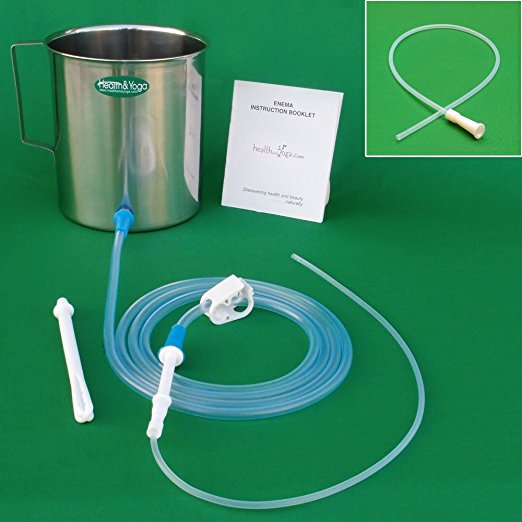

There is no scientific evidence to indicate that coffee enemas detoxify the bowel, liver, or gallbladder. The Gerson Therapy treatment, which includes daily coffee enemas, is currently being touted as an alternative cancer treatment. This is not only scientifically unproven, it is also a dangerous notion that encourages people to forgo proper medical treatment.

### Top 10 Dangers of the Coffee Enema

The dangers associated with the coffee enema, green tea enema, coffee colonic (coffee or tea high enema), and coffee or tea suppository are as follows:

1.  Adding ingredients to the enema recipe (such as coffee, green tea, vinegar, baking soda, bath/Epsom salt, or minerals) is not proven to do anything superior to the effects of plain saline.
2.  Inserting anything into the anus may result in anal tearing.
3.  Re-used (instead of single-use) enema kits may carry bacteria, which could result in an infection.
4.  The use of hot liquid in the rectum could result in serious internal burns.
5.  Extensive use of enemas could result in dehydration.
6.  Overuse of coffee enemas could result in electrolyte imbalances.
7.  The caffeine in the coffee or tea enema may lead to caffeine addiction.
8.  Caffeine enemas must be avoided by pregnant women and people with caffeine sensitivity.
9.  Overuse of any type of device designed to temporarily excite the nerves of the colon (such as an enema, colonic, or suppository) could result in decreased function of the bowels.
10.  The colonic does not magically remove cancer-causing toxins. It will create watery stool and stimulate the release of fecal matter from the last few inches of the lower bowel. Do not forgo licensed medical attention in favor of this dangerous alternative.

### Still going to do a coffee enema? Minimize risks

If you insist upon performing this dangerous procedure, please consider the following minimum precautions for the at-home coffee enema or tea enema. Use a short-nozzle, single-use disposable kit and utilize copious amounts of personal lubricant jelly during insertion. Be sure that the coffee is room temperature or cooler. Also, please minimize the numberer of enemas that you perform; at an absolute maximum, do one enema every week to ten days.

### Resources

[Coffee Enema Benefits vs Dangers](/coffee-enema-benefits-vs-dangers/) – The article by health professional Kristina Amelong was submitted as a point-by-point response to this article.

[How to Perform a Coffee Enema](/coffee-enema/) – An overview of the coffee enema topic along with instructions.

*Photo by [Namphuong Van](https://unsplash.com/@namphuong)*
