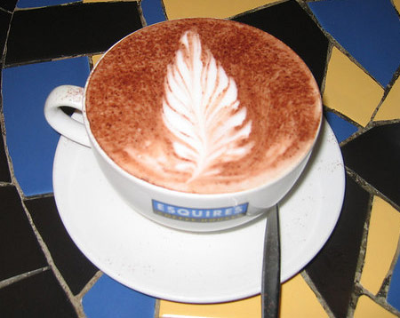

**1\. Cleanliness.** Look at things like the steam wand, the espresso machine, and the counters. A meticulously clean coffeehouse probably means people care about other things, such as keeping cockroach colonies to a minimum.

**2\. Staff.** Consistently friendly, happy staff will probably put that same energy into your drinks. At the very least, it makes you feel good after dropping $3.75 on 2 ounces of espresso, right?

**3\. Crowds.** If you see many people, this could be a good sign. (OK, Starbucks might be the exception). Not that Starbucks has bad coffee…

**4\. Roasting.** A coffeehouse that roasts its own coffee (especially on-premises) at least means you have a good shot at fresh beans. They may roast too dark, but it is a start. You may even be able to sweet-talk the owner or roaster into going a little lighter. Tread Lightly Here.

**5\. Menu.** If there is more coffee on the menu than other stuff, you are on the right track. Test the waters; buy a cup, but don’t tip for now. If they have 12 different sandwiches, and 7 coffee drinks, spit that tuna salad sandwich out and remove them from your little black book.

**6\. Drip Coffee.** Frequent brewing and digital timers on the air-pots are a good sign. Several selections can be good too. Look for a changing palate of selections, and if there are more flavored coffees than single origins or blends, you may be in trouble. Another bad sign is a bunch of blends, and never the mention of a Kenya AA, Guatemala Antigua, or Ethiopian Harrar. True coffee aficionados know their regions.

**7\. Espresso.** If it looks like they actually dose and tamp, and time the shots properly, they may actually know what they are doing. If you see an 11-second shot, run away and grab a couple of bucks out of the tip jar on the way out. Ski mask optional.

**8\. Latte.** If you order a Latte drink, and they do Latte art, you have probably found *the* place. It is not easy to do, and it shows the Barista cares very much about your washtub of milk with coffee.

**9\. French Press.** If they even offer French Press, you are probably in a cool place. If they grind to the correct coarseness and don’t give you boiling water, you may be in coffee heaven. OK, not heaven, but you are certainly on your way out of purgatory.

**10\. Barista Training.** This might require some inquiry. But if the owner puts his Barista through training (and it will show), that means he cares deeply about your needs. In a platonic way of course.

Remember, the best espresso served by a rude Barista is no fun. Neither is a paper cup full of burnt crap served by the most pleasant Barista. And forget about sandwiches and pastries. Remember, you are going to a ***Coffee** House*.