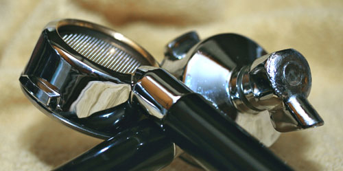

*Full title: TOP TEN WAYS YOU KNOW YOU ARE \*REALLY\* INTO COFFEE (READ: YOU HAVE CROSSED THE LINE)*

1\. The “Coffee Fairy” leaves coffee beans under your kid’s pillow in exchange for their molar.

2\. You quiz the pimple-faced teenager at McDonald’s on the exact roast date of the “100% Arabica” coffee being served that day.

3\. You vandalize the local Starbucks by breaking in and taking a hammer to the new Super-Auto espresso machines, and as you leave, you spray paint a message that reads “Real Baristas grind and tamp their own coffee!!!”

4\. You ask for the espresso machine and grinder in the divorce settlement but agree to give your wife the house.

5\. You enjoy watching squirrels after eating nuts into which you have cleverly embedded a coffee bean. You repeat this dastardly behavior on other animals like dogs, cats, armadillos, and blue jays.

6\. You had your pool made into the shape of a coffee bean when viewed from above. Unfortunately, now that the divorce is final, your wife gets to enjoy it now, along with the pool guy.

7\. You contend that Elvis’ favorite snack was actually a fried peanut butter and banana sandwich, 3 Quaaludes, and a non-fat, 2 pump, extra shot, caramel macchiato chaser.

8\. Your favorite [BBQ rub includes ground coffee](/coffee-and-barbecue/), and you insist on using it on that $52 hunk of Filet Mignon, despite your guests telling you that it tastes like crap.

9\. You spent $6300 on a new DSLR Digital Camera setup simply to take close-up photos of coffee beans and [naked portafilter](/the-naked-portafilter/) shots. Your current girlfriend is considering a palimony suit.

  
*[Naked Portafilter](/the-naked-portafilter/) by Chris Arnold*

10\. You roast your own coffee, but you insist on roasting each bean individually for ultimate quality.
