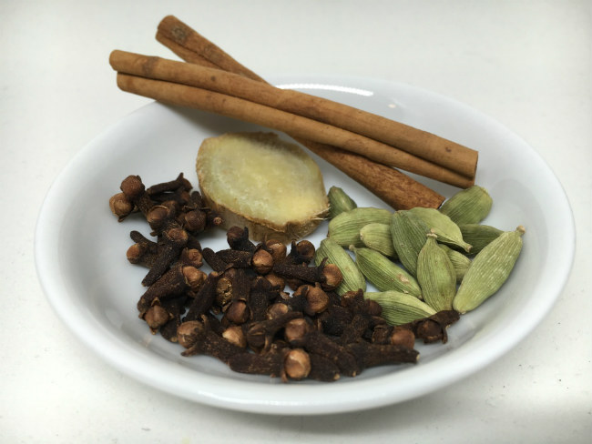
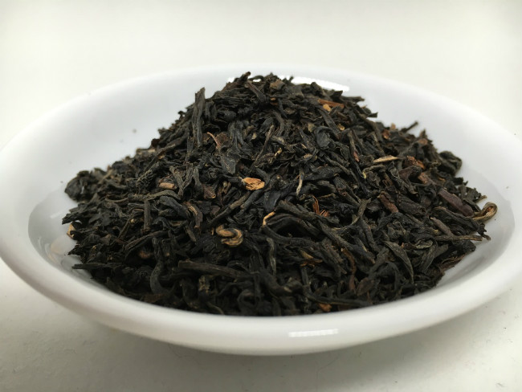
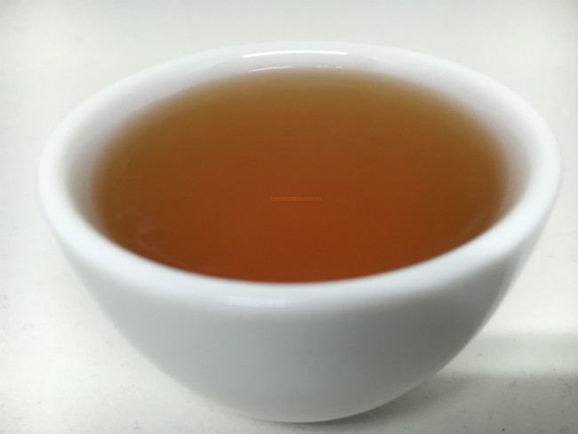
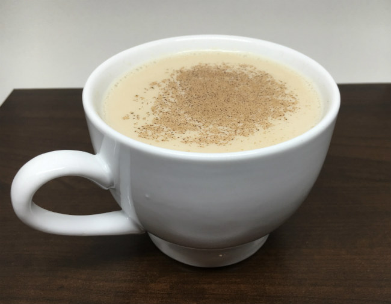

You have to try a slice of Key Lime Pie when you’re in Key West. In Maryland, it’s all about crab cakes. And no place owns pizza like New York City does.

The flavors, as much as anything else, define a place.

In India—a country with more than 1.2 billion people—the drink that helps define its cultural palette is Masala Chai. The name translates to ‘mixed-spice tea’ in English, and that’s the perfect summary. Chai’s rich flavors vary by region, but it always contains four essential ingredients: milk, sugar, cardamom, and ginger.

*Cinnamon, cloves, cardamom, and ginger.*

Sold on the streets of India by tea vendors called chai wallahs, its unique notes have won the world over. Now virtually every coffee and tea shop across the globe has its own version of Masala Chai.

Despite the complexities of Chai, it’s incredibly easy to make yourself at home, which allows you to tailor the spices to best suit your taste buds. Let’s walk through how to make a traditional Chai. Here’s what you’ll need.

### Ingredients

-   4 cups water
-   4 teaspoons loose Assam tea
-   8 cardamon pods
-   4 cloves smashed
-   1 cinnamon stick (optional)
-   1/2 teaspoon ground ginger
-   2 tbsp brown sugar (use 3 if you like it on the sweet side)
-   2 cups milk
-   1 shot espresso (if you want a ‘dirty’ chai)
-   First, roughly grind the cardamom, cloves, and cinnamon. A mortar and pestle work best for this, but if you have a coffee grinder handy you can use that, too.

Heat the milk in a large pot, bringing it to a simmer and adding the ground spices and brown sugar. Once the sugar has dissolved you can taste and add more if needed. Let it simmer for 3-4 minutes.

While the spice mixture cooks, make the tea. If you’re using loose leaf tea, put the leaves in a teapot, then pour 4 cups of hot water over the leaves. If tea bags are easier, that’s great too, you’ll need 4 cups of brewed tea.

*Assam Tea Leaves*

*Brewed Assam tea*

Once the tea has finished steeping, slowly pour it into the pot of spices, mixing as you go. If you’re making a ‘dirty’ chai, add a espresso shot (or two).

Let simmer for 1-2 minutes more, remove from the stove, pour, and enjoy!

*Chai*

### Resources

[A Coffee Lover’s Guide to Tea](/a-coffee-lovers-guide-to-tea/) – INeedCoffee article

[Coffee and Tea Tasting Notes For Beginners](/coffee-and-tea-tasting-notes-for-beginners/) – A method for learning which teas you like the best.
