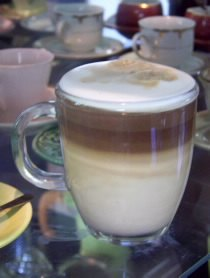
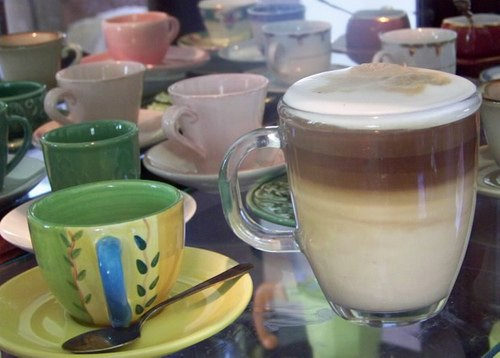

I recently made a Tres Leches cake for my blog. For those not familiar with Tres Leches, it is a dense sponge cake that has been soaked in a syrupy mixture of evaporated milk, sweetened condensed milk, and heavy cream, hence the name Tres Leches (three kinds of milk). The cake is then topped with whipped cream making it a decadent Latin-American treat.

When making this cake it is always assured that you will have leftover milk syrup. Instead of dumping it down the sink, I thought, “why not make coffee with it?” The result was spectacular!

  
*Tres Leches Latte*

### A Tre Latte Latte! (Italian for Tres Leches Latte)

The Tres Leches milk syrup is roughly two parts evaporated milk, two parts sweetened condensed milk, and 1 part heavy cream. Since you will surely want to share it with your friends, the easiest recipe is as follows.

Stir together:

-   1-14 oz can of evaporated milk
-   1-14 oz can of sweetened condensed milk
-   1 cup heavy cream

For my latte, I started with a 4 oz espresso.

Steam: 5 oz milk, 3 oz Tres Leches syrup, and 1/4 tsp vanilla extract.

For the really cool layered look first: put the milk in the cup, wait until it’s settled, and then add the espresso very slowly. It will automatically separate. Don’t even try to count the calories! Just enjoy!

  
*Layered Latte*
