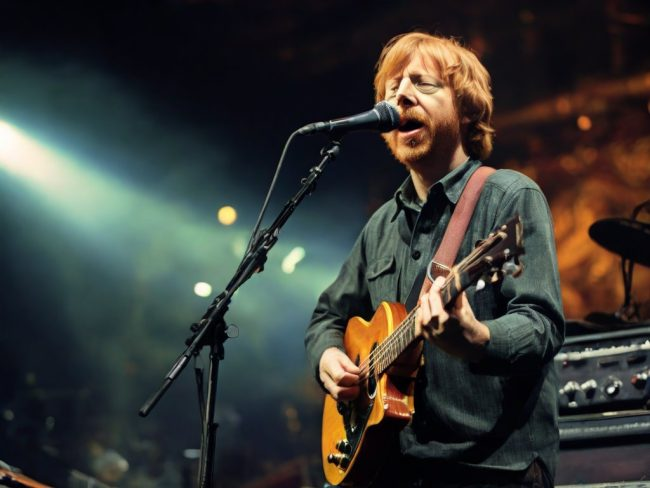

A handful of professional athletes can claim to have done what Phish did musically – quit on their terms while on top. John Elway’s entire football career seemed destined to become a refrain of “could have beens” until he capped his sixteen-year NFL career by leading the Denver Broncos to back-to-back Super Bowl victories, then retired a champion. Longtime Boston Bruin Ray Bourque was traded to the Colorado Avalanche late in the 2000 NHL season, played a vital role in Colorado’s 2001 Stanley Cup crusade, and then retired a champion.

In the musical world, Phish did the equivalent in October 2000. In the previous year, the band drew over 80,000 to an Indian reservation in Florida, for the highest-grossing millennial New Year’s Eve concert. Their CD release *Farmhouse* boasted some well-written and very jammable concert favorites, and their inventory of concert songs ran wider and deeper than ever before. At the height of their concert success, though, the band mutually agreed to take an “indefinite hiatus” at the end of their fall tour. They made good on their word. The end of the road came in Mountain View, California, where Phish played two stellar shows, capped them with an encore of their all-time show-stopper concert song, “You Enjoy Myself”, and walked away, leaving it up in the air if or when they would ever play another concert again.

*Trey Anastasio singing*

When relationships run their course, some people show an ability to rebound to the next thing without skipping a beat, and Trey Anastasio, formerly Phish’s guitarist and musical quarterback, seems like such a person. He was already looking ahead to the “sabbatical” as the 2000 tours progressed, informing Entertainment Weekly that his plans for Phish’s sabbatical included “Sitting at the piano, drinking coffee, and writing, occasionally getting up to cook.”

Much of this itinerary is to be taken with a grain of salt — contrary to the sedentary bliss he described, Trey has spent 2001 working with the Vermont Youth Orchestra, touring with a new “solo” band in the spring and summer, and touring again with Oysterhead, a power trio that also includes Les Claypool of Primus and Stuart Copeland of the Police.

We can take his stated ambitions to drink coffee more literally — throughout his ascent with Phish, Anastasio has repeatedly shown that he is a certified coffee lover. In a year in which he left the safety of a band that put him on the musical map, it seems clear that Trey gets by with a little help from his friend Coffee which gives him a push forward and onward as it does for so many of us.

### Living on the jam, jamming on the coffee

Not everybody has a taste for jamming, improvised music. Somebody who loves the symphony orchestra rightfully expects the musicians to play pieces they have rehearsed thoroughly, and while a fine-tuned ear can appreciate the excellence of individual performances amidst the symphony of sound, or recognize a stellar performance of a piece, an orchestra is not generally expected to meander very far from its compositional structure. In popular music, concert expectations are often similar.

Many people who have paid their hard-earned $50 plus $10 TicketMaster “service fee” want a flawless, rigidly scripted product. The Rolling Stones, Jimmy Buffet, Madonna, and U2 generally tour with an unchanging setlist, with solos, choreography, and stage pyrotechnics that were laid out long before they reached your hometown. Most people at the pavilion want exactly that.

And then there are the rest of us. We are the ones who are stuck explaining to puzzled friends and relatives why seeing four consecutive Phish concerts was different from seeing four consecutive U2 concerts. Your expectations are different if you love improvisational music. At a Rolling Stones concert, you want “Satisfaction” to rock hard every time. At a Phish concert, you wanted “You Enjoy Myself” to be goth and dark one time, sentimentally beautiful another, bouncy and funky the next, and arena-metal rocking afterward. The biggest possible disappointment would have been a performance that aped the studio album version note-for-note.

Improvisation requires a different type of talent, demanding that the musician adapt to the mood and atmosphere where he is performing, respond interactively to the progression of his fellow musicians, and move ahead without solid, known ground beneath his feet. This is the way that Anastasio thrives.

Starting in 1996, Phish began a tradition of capping their summer tour with an outdoor, Woodstocky multi-day mega-concert with conceptual themes and three extended sets of music each day. Approaching the Clifford Ball, their first such festival, Anastasio foresaw a unique opportunity to play in previously foreign environments. In an interview with *Addicted to Noise*, Anastasio later described the different moods Jimi Hendrix displayed playing at different times of the day. Trey and his bandmates now had the opportunity to take the stage around the clock, and see where the different atmospheres would take their music:

> Everybody always plays at 7:30 at night. \[I wondered\] what would it be like to play first thing in the morning? So we played the first day at sunset. Then we took a long break. Then we played that midnight or something or 11 PM. Then we hung out a few hours. Then at four in the morning we went out on this flatbed truck and did this rolling set where we were moving. Then went back, hung out, caught a couple hours of sleep, woke up. Then the next set was I think at noon the next day, which was first thing in the morning for me. I remember I woke up in this trailer, I had slept about four hours, came out, had a cup of coffee, finished the cup of coffee, put it down and walked right back out on stage. It was great. It was such a great feeling. It just seemed like this whole weekend ended up becoming one big thing.

Trey took the stage off minimal sleep and was fueled by some coffee. If he had wanted to perform in yet another state of mind, he could have begun the set without the benefit of any coffee at all, but it is probably a good thing that Anastasio didn’t attempt this.

### A musical coffee talk

The comparisons were inevitable. As Phish’s popularity began its ascent, and especially after Grateful Dead guitarist Jerry Garcia died in 1995, Anastasio had to allot a high percentage of his interviewing time downplaying the constant “Next Grateful Dead” slant in the line of questioning he faced. Dead fans, Phish fans, and Anastasio himself, could describe musical differences between the two bands until the Ben & Jerry’s cows came home, but it’s still easy to see why Phish was so frequently likened to the Dead – Musically, both were in their element on stage and generally out of their element in the recording studio, and the artistic focus of both was their live music.

Any rock band whose bread and butter was a jamming, improvisational concert risked remaining in the shadow of the Grateful Dead, the most revered pioneers of jam-rock. The atmosphere at a Dead concert was also similar to that of a Phish concert, places where the parking lot on the days of a show was every bit as lively as inside the venue, buzzing with tour heads who were on the road with the band for months at a time, impromptu music circles, and unlicensed vendors peddling wares of varying legality. From the musical and technical to the stereotypical and superficial, there were plenty of reasons to mention the Dead and Phish in the same sentence.

Phish, largely at Anastasio’s insistence, did what they could to thwart comparisons with the Grateful Dead, and while they played some Dead songs in their early bar gigs in the mid-1980s, they went most of the way through the 1990s without covering a single Dead song. That changed in the summer of 1998 when on the third anniversary of Garcia’s death, Phish surprised the Virginia Beach crowd with an encore of the Dead’s beloved “Terrapin Station.” Tapes of this concert are a sound to behold — as the sentimental opening notes are played, an increasing roar arises from the crowd as those in attendance begin to recognize the song. Nearly everybody seemed to recognize the unspoken significance of the song – that Phish was, at last, making peace with the fact that the jam-band torch had several years ago been passed into their hands from the Grateful Dead.

Anastasio now seems to fully embrace the legacy of the Grateful Dead. About one year after the “Terrapin Station” icebreaker, Anastasio played with former Dead bassist Phil Lesh’s musical project, Phil & Friends. Lesh and Anastasio have since collaborated musically on several other occasions, but Anastasio seems most enthralled with the chance to talk to Lesh and drink coffee with him. Masato Kato [interviewed Trey](https://web.archive.org/web/20150601045910/http://www.philzone.com:80/interviews/trey/) in a May 2000 article for *The Phil Zone*, and the interview gives a very revealing look at the developing friendship between the two musicians:

> Trey: It was great! I was just with \[Lesh\] two weeks ago. I did an interview with him for Revolver magazine – the two of us. It was incredible – not just to play with him but to talk to him. We spent a week together rehearsing.  
> MK: Only a week?  
> Trey: Yeah, if even that – it might’ve been four days or something like that. But it was every day and we got to sit and drink coffee and talk. He’s an incredible guy and obviously he’s got such an amazing history as a musician and just as a person that it was great for me – that was my favorite part – just the rehearsals – because, like I said, we would just sit and talk. I learned so much about music and living – you know, and just about being a good human being. You know, he has a lot of integrity.

### Not trying to live a completely caffeine-free life

Phish’s song “Fee” made its concert debut in 1987, and was the opening cut on their first commercial album, “Junta.” While “Fee” is not the epic, multidimensional evolving jam song that would one day be Phish’s trademark, it is probably an anthem of sorts for many fans. Its lyrics, written exclusively by Anastasio, are almost bedtime story caliber, telling the story of Fee the weasel and his battle with Floyd the chimpanzee for the love of a “fading beauty” named Millie Grace. In the chorus, Anastasio has advice for Fee:

> Oh, Fee, you’re trying to live a life  
> That’s completely free.  
> You’re racing with the wind  
> You’re flirting with death  
> So have a cup of coffee  
> And catch your breath  
> — Phish

There were rumors among the Phish tour heads that one man in their midst had his name legally changed to Fee because, indeed, he was trying to live a completely free life. Get it?? The rumor is an old one, and it remains unknown to me whether this real-life Fee existed, let alone whether or not he succeeded in living a completely free life. From the lyrics, though, I can predict what Dr. Anastasio would have prescribed for this overzealous fan – a nice break from following the band around so diligently, and a cup of coffee in the comfort of home, before returning to the road with a new alias.

It is debatable whether Phish was more instrumentally groundbreaking in their early days or their later ones, but few would dispute that their lyrics improved with time. “Fee” comes from a generation of Phish lyrics that were primarily nonsensical or surface-level narratives, and it wasn’t until the mid-1990s that their songs began to consistently show lyrical depth. “Theme From the Bottom” was first performed in 1995, a well-written and instrumentally complex song whose studio version landed on Phish’s 1996 CD “Billy Breathes.” The lyrics are the collaborative effort of all four band members and their chief lyricist Tom Marshall, and among those five is at least one who believes in the awakening powers of coffee:

> I feed from the bottom, you feed from the top  
> I live upon morsels you happen to drop  
> And coffee that somehow leaks out of your cup  
> If nothing comes down then I’m forced to swim up  
> — Phish

Ostensibly about a deep-sea creature who lurks in the darkness below, “Theme” seems like an allusion to suppressed thought or memory that remains unexposed to the light of day until something triggers its ascent to the surface, where color and light return. It subsists off leftovers and, of course, coffee, perhaps requiring a bit of a caffeine jolt to emerge from the unseen depth.

On his solo tour, Trey has introduced an original instrumental which he calls “The Happy Coffee Song.” In the interest of full disclosure, I should admit that I’m unqualified to analyze this new addition to his setlist – I’ve heard it only once, and it left no lasting impression. Fans posting concert reviews have alternately described it as catchy or forgettable. Furthermore, there aren’t any lyrics to analyze, so we can only look at the simple fact that Anastasio remains inspired to keep coffee in his musical repertoire – not an insignificant fact. Happy are the coffee drinkers.

### The Mocha Dance

Both in his own words and in those of others, Trey seems to consider coffee a staple of his life. In addition to all the unique situations in which he downed some coffee, he seems to drink it during more routine, everyday events. In an [interview](https://www.gadiel.com/phish/articles/sno.html) with Sno Magazine in December 1997, Anastasio described a morning routine of coffee and skiing in his Vermont house. “Just about four years ago we started \[cross-country skiing\] because we moved to where there’s a lot of woods’ Trey explained. “There’s other skiers nearby, people are cutting trails. I go almost every day when I’m home. I wake up, have a cup of coffee, strap on the skis and I’m out into the woods.”

Others have noticed Trey benefitting from a coffee “pick-me-up”. The following comes from *Addicted To Noise* (site down – MAY 2011), summarizing an interview they held with Anastasio in June 1995. “Recently, Addicted To Noise caught up with Anastasio the morning of a show at the Boise State University Pavilion. While initially quite sleepy, after some fruit and coffee, Anastasio was more than ready to talk shop.”

Does his routine seem familiar to you? Whether he is doing something for the sheer love of it, like skiing, or fulfilling an obligation of his trade (conducting an interview), Trey gets rolling after his morning or early-day cup of coffee. Like his fellow coffee achievers the world over, he seems better able to perform at his best after the coffee is in his system.

### An incarnate extension of his music

If there was any doubt before, this past year has made it clear that Anastasio’s life is now an incarnate extension of his music — daring to depart from the known and the safe and the structured biographical improv jam. He has demonstrated time and again a constant forward momentum and a desire to play his music in all conceivable scenarios with an ever-evolving cast of accomplices. And when he needs it, Anastasio isn’t afraid to down a cup of coffee or two. Be he solo, or back with Phish, or be he with any existing or future side projects, INeedCoffee salutes Trey Anastasio as a Coffee Achiever.