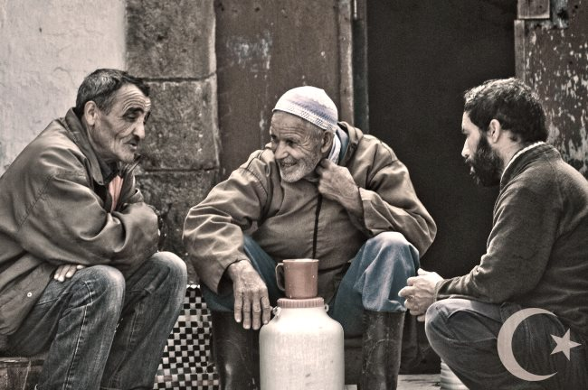
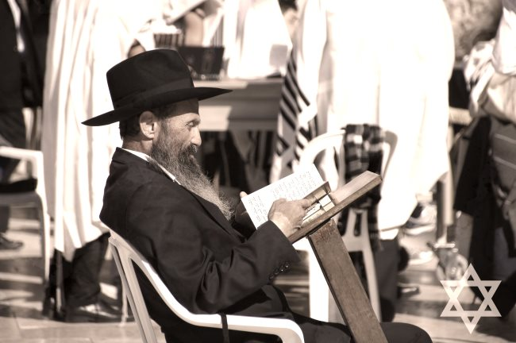
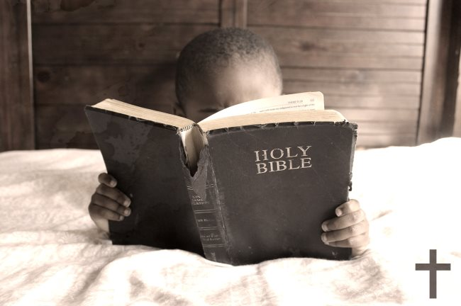
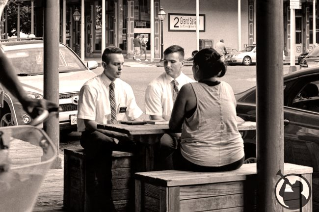
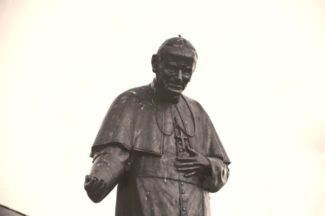

The Father, The Son, and The Holy Bean

> Black as the devil, hot as hell, pure as an angel, sweet as love.  
> \-Charles Maurice de Talleyrand, French Diplomat

Have you ever taken a sip of your favorite brew, tilted your head upwards to the heavens, closed your eyes, and exclaimed, “God, that’s good coffee!”?

If you have, you are among the millions and millions of people from all faiths and belief systems who only believe in God because of coffee. Take away the miracle of the coffee bean, and these people would either become agnostics or atheists. And all of them would be sleepy.

After all, coffee for many people is religion. We worship it in many different forms, and we exult it through rituals and customs; the Grinding of the Bean, the Sacrament of the Pour Over, the Vow of Silence (until you’ve had at least three sips).

We proselytize and spread the Good News about the coming of Intelligentsia to our neighborhoods. We share stories about the miracle of the “Ethiopia Kayon Mountain Natural” and the wonders of “Sumatra Boru Batak.”

Yet, while we know a lot about coffee, we have virtually no knowledge of how major religions view it. What do our priests and pastors and rabbis and mullahs and gurus think of the beautiful elixir? And do they drink it?

History, like Sean Spicer, provides most of the answers.

### Islam

Hundreds of years before travel bans and ISIS were invented, coffee became very much in demand in the Arab world. It all started with those surfing Sufis in southern Arabia who started brewing the stuff in the 13th century. Sheik Abu’l Hasan ‘Ali ibn Umar, or “Skippy” to his friends, traveled to Ethiopia and discovered the coffee culture there, so he decided to bring it back home to Yemen. Because it provided “wakefulness” during late evening prayer, coffee became very popular. “Allah Akhbar! We love our coffee!”

Soon after, even without social media, the word spread throughout the Islamic world, and qahwa was consumed everywhere, even at the holiest mosques in Mecca. It was affectionately known as “Islamic wine.”

The southern Arabian climate was perfect for coffee cultivation, and the ports of Yemen became the world’s primary exporters of coffee. Many fortunes were made from coffee exports, wealth that rivaled the money made by Howard Schultz. (It’s rumored, by me, that the star in Starbucks is a tribute to the Islamic star.)

Mystic theologian and coffee-phile Shaikh ibn Isma’il Ba Alawi of Al-Shihr, or “Shorty” as his friends called him, asserted that the use of coffee before prayer could lead to the experience of qahwa ma’nawiyya or “one kick-ass trippy spiritual experience.”

Traders, pilgrims, and students traveled throughout the region extolling the virtues of drinking coffee and, sure enough, coffee houses sprung up in the entire major cities, especially Cairo. Unfortunately, few of them offered free WiFi.

However, not everyone embraced bean juice, and throughout the later centuries in the Arab world, there were attempts to make verboten coffee. Those efforts were usually thwarted, however, because even religious leaders were hooked.

Coffee prevailed. Praise Allah!

### Judaism

The relationship between coffee and Judaism runs deep and often parallels what was happening in the Arab world. Religious devotion drove its initial popularity; the later you could stay awake, the more you could tell God that you like him a lot.

And because it’s deemed “kosher” (unless your coffee has chunks of pork swimming in it), coffee became popular with the Jews in cities like Damascus, Cairo, and Constantinople. (FYI: Now it’s Istanbul, not Constantinople.) In fact, the first coffee house opened in Constantinople much to the delight of the He-Brews (sorry, I couldn’t help myself).

In 1632, it was a Jewish man who opened the first coffee house in Europe, in Livorno, Italy. Eighteen years later, a Sephardic Jew, charmingly called “Jacob the Jew,” founded the first coffee house in Oxford, England. Many Sephardic Jews became coffee traders during this period and brought the idea of coffee houses to France and the Netherlands.

Of course, where Jews prosper, antisemitism rears its ugly head. In Germany (surprise!), there were attempts to close down the Jewish coffee trade because coffee was threatening their beer industry. But coffee, as it always does, prevailed.

By the 1800s, coffee houses in Berlin, Vienna, Budapest, and Prague were at the forefront of social change. Vienna’s café culture flourished as Jewish scholars, writers, and artists would order their coffees, sit down, and talk politics, literature, and a hundred other topics for hours. The coffee house was the place to be seen and heard.

In 19th century America, Jewish traders began operating from seaport cities such as San Francisco, New Orleans, and New York. The New York market was very particularly competitive, and fortunes were made by men such as Samuel Schonbrunn who produced the high-quality Savarin brand served at the Waldorf-Astoria, and William Black, whose nuts shops became Chock Full o’ Nuts coffee shops.

Today, the aforementioned Howard Schultz carries on the great Jewish tradition of the coffee house with his 20,737 stores in 63 countries and territories. Oy gevalt!

### Christianity

Coffee and Christianity. A match made in Heaven. Exclamations like “Jesus Christ, this coffee is great!” can be heard in all parts of the world every single day.

Biblical scholars know that Jesus never drank a cup of coffee himself, but there is speculation that he did foresee its power during his Sermon on the Mount when he said, “Blessed are the sleepless for they have drunk from the cup of Joseph.” Could ‘cuppa Joe’ be far behind?

If you’ve ever gone to church or church meetings, coffee looms essential. After services, groups of worshippers often gather in church basements to enjoy a cuppa. While most Evangelicals frown upon liquor, Baptists, Methodists, and Lex Lutherans can all agree that coffee is a true blessing.

However, the road to caffeinated bliss was oft-times bumpy. Back in the 16th century, a group of java-hating priests petitioned Pope Clement VIII to ban what they called “the devil’s drink.” the ‘devil’ part a slap in the face to all Muslims.

“Not so fast,” proclaimed the Pope. So, he had a cup of coffee brought to him. After his seventh cup and a Danish, old Clement leaped out of his Pope chair and exclaimed, “Why, this Satan’s drink is so delicious that it would be a pity to let the infidels have exclusive use of it. We shall cheat Satan by baptizing it.”(true story)

And, for coffee drinkers, it just kept getting better. Here’s an anecdote I found:

In 1683, a Franciscan friar named Marciano d’Aviano stopped a Turkish invasion of Austria, and along the way, some claim invented the cappuccino. The retreating Turks left behind bags of coffee beans, historians say, which the Viennese found so bitter that they added milk and sugar, creating a frothy, sweet beverage. Legend says the word “cappuccino” comes from d’Aviano’s Capuchin order, so named for their brown robes.

Ergo, the word “Frappuccino” must be named after Capuchin friars.

### Mormonism

Mormons don’t drink coffee. This topic is covered in greater detail in the INeedCoffee article [Why Mormons Don’t Drink Coffee or Tea](http://ineedcoffee.com/why-mormons-dont-drink-coffee-or-tea/).

### Religion and Coffee

As you can see, religion and coffee go together like soup and a sandwich. Except, we’re talking about coffee. So, the next time you have a religious experience while drinking your favorite brew, think of the history that went into it. If not for some adventurous Sufi guy back in the 13th century, you might be sitting there sipping a warm cup of… tea.

Heaven forbid!

### Resources

[Coffee: The Wine of Islam](https://superluminal.com/cookbook/essay_coffee.html) – by Kathleen Seidel

[The Stimulating Story of Jews and Coffee](https://web.archive.org/web/20210517050038/https://momentmag.com/the-stimulating-story-of-jews-and-coffee/) – by Eileen Lavine

[Father, Son and Holy Roast: How coffee became Christians’ acceptable vice](https://web.archive.org/web/20210927020522/https://www.washingtonpost.com/news/acts-of-faith/wp/2015/04/02/father-son-and-holy-roast-how-coffee-became-christians-acceptable-vice/) – by Laura Turner

*Photos courtesy of Free Range Stock*