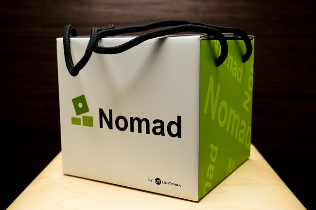
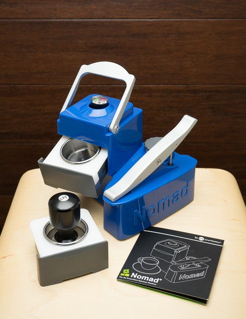
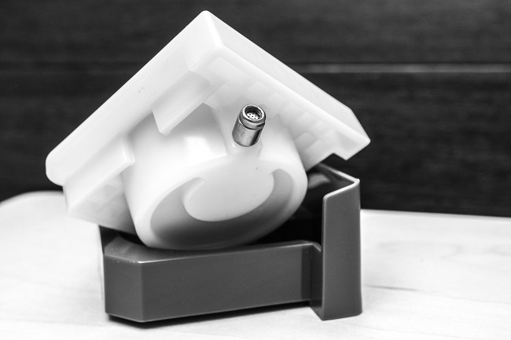
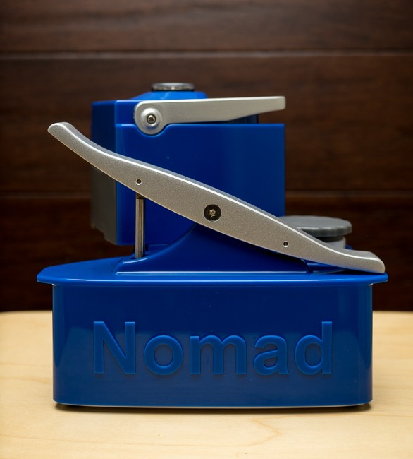
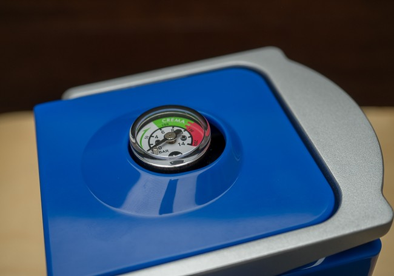
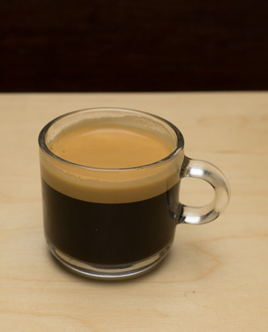
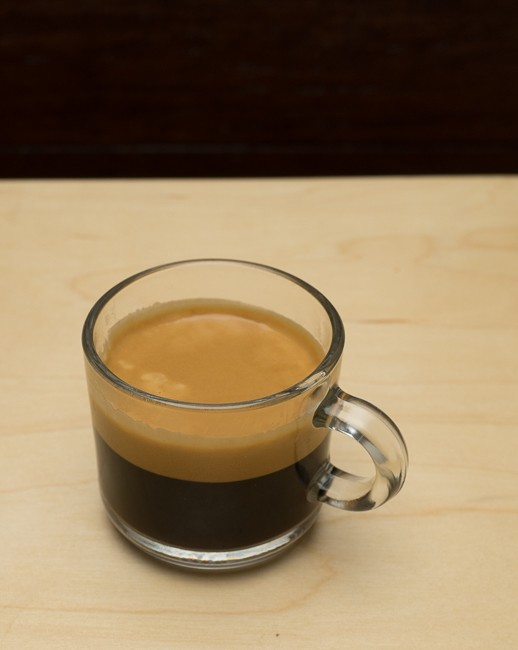
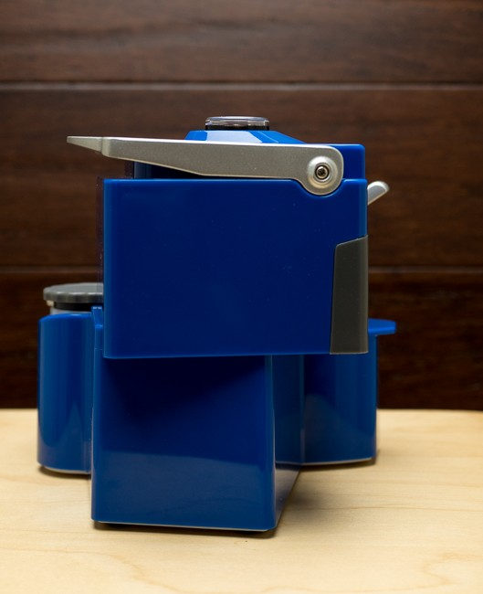

There are quite a number of handheld espresso makers, mainly targeted at campers, backpackers, and ultra-light road warriors.

The Nomad by UniTerra is similar in that it is hand-operated and requires no electricity, but it comes in a larger but still portable form factor. It seems more appropriate for a picnic, road trip, vacation home, dorm, office, or even your primary residence.

The question with all hand-powered espresso makers remains the same: How good is the espresso compared to their electric-powered counterparts? Read on to find out.

### Nomad Espresso Machine by UniTerra

The Nomad is an oddly beautiful looking device with strange geometric angles and lines, and yet it looks like a small piece of art that anyone would be proud to display. Mine is a gorgeous Cobalt Blue with matte silver accents. It is also available in a Luminescent Green color.

The Nomad is made up of the main base unit and attached pump lever, a built-in water tank and removable cap, and filter assembly (coffee drawer, brew box, and basket). Nomad also includes very detailed printed instructions and a tamper.

The build quality is simply excellent. The fit and finish are probably the best in just about any coffee product I have reviewed over the years, including the $2000+ prosumer Italian espresso machines I have purchased on my own.  The unit is designed in the USA and made in Taiwan.

One of the unique features of the Nomad Espresso Machine is what they call the True Crema Valve, or TCV. It claims to compensate for tamping and [grind level](/coffee-grind-chart/) variations. They even say that you can use pre-ground coffee from the store or ground beans from a whirly blade grinder and still get excellent results. The TCV can be removed, which then means the ground and tamp become more critical, just like an unforgiving espresso machine. I did not experiment with a poor grind nor did I remove the TCV. I might do this in the future to compare and understand the capabilities and limitations.

*Patented True Crema Valve (TCV)*

Making a shot of espresso is relatively straightforward. It starts with filling the water reservoir with about 7oz (200cc) of boiling water, and filling the basket with finely ground coffee and tamping. It is then recommended to pump about 12 times for pre-infusion and then wait a few seconds. Then you pump until you are in the green zone indicated on the pressure gauge. Now you just pump the seesaw lever fast or slow enough to keep it in the correct range until your espresso is done.

*A seesaw lever that operates dual pistons*

*Pressure Gauge showing the Optimal “Crema” Zone*

### Impressions

I experimented with a Brazil, about 5 days off the roast. At first, I used a grind level that I had set up for my Izzo Alex Duetto III and didn’t fill the basket fully. The crema was good, and the flavor was nice. I then adjusted the grind finer and filled the basket to the max. The result was even more crema and flavor. It was very close to the Alex, and in some ways was smoother. I was really impressed with the flavor, and ease of repeatability.

*First, using a coarser grind and less coffee. The results were good.*

*Second, using a finer grind and more coffee. The results were excellent.*

Because the filter assembly has several pieces, cleanup requires running water. So, if you need to serve several espressos out in the field, I would recommend extra filter assemblies, which are also available for purchase separately.

### Additional Thoughts

There are always a few things that could be improved with all products. I would like to see all of these things improved on V2, but none are showstoppers that would keep me from purchasing the current generation of the Nomad.

I found that the fill spout was placed a little low, which made it awkward to fill, so I would like to see a slightly higher fill spout.

There are times when you end up using your palms to maintain the proper pressure on the seesaw lever, and it would be nice to see a little more comfortable shape at the ends.

My Illy cappuccino cup barely fits under the machine, actually lifting the machine up just a bit. I would like to see more clearance for taller cups.

### Conclusion

At just under $300, the Nomad is by no means inexpensive. However, I would say its flavor and crema rival more expensive electric-powered espresso machines, so in that sense, I consider it a bargain. Electric-powered espresso machines can also use a lot of electricity, so this could go a long way toward lowering your electricity bill and potentially your carbon footprint. You also have something portable, which greatly increases versatility. Add to that a very strong aesthetic quality, and just about anyone would be proud to leave this out on the kitchen counter or office desk.  The Nomad is highly recommended.

### Resources

[Battle of the Handheld Espresso Makers: Handpresso Wild Hybrid vs Wacaco Minipresso GR](/battle-handheld-espresso-makers-handpresso-wild-hybrid-vs-wacaco-minipresso-gr/) – Overview of two handheld espresso makers.

*Disclosure: INeedCoffee was sent this product at no cost, which did not affect its review.*
