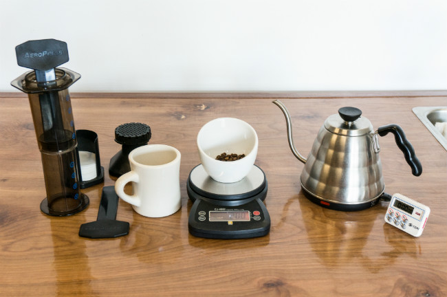
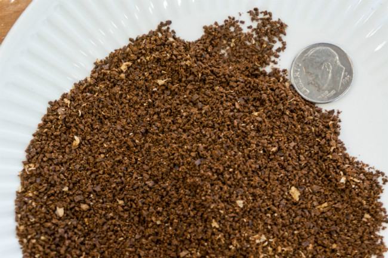
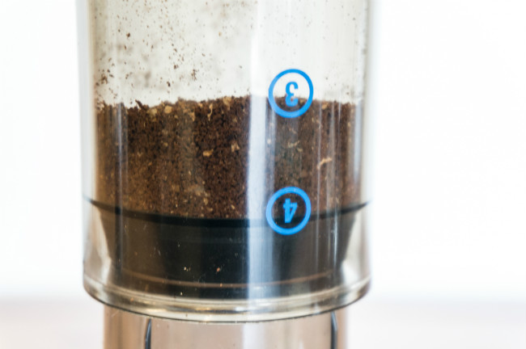
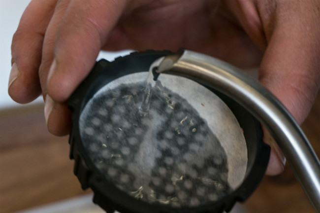
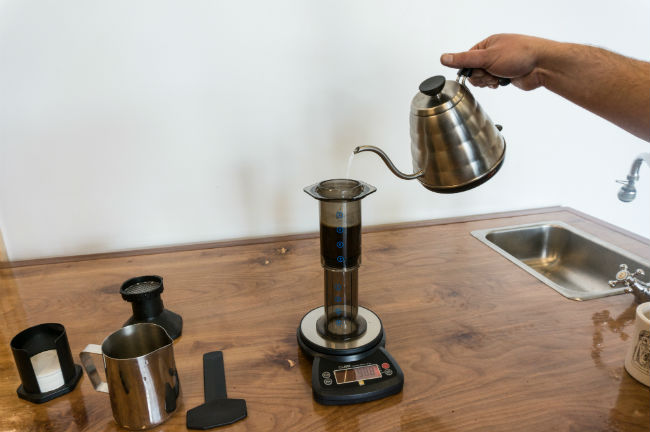
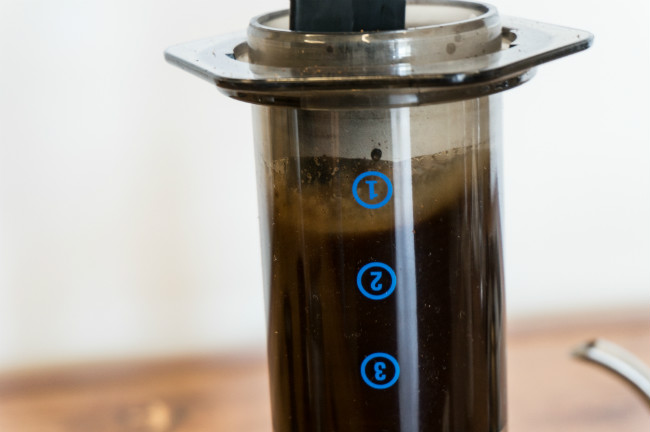
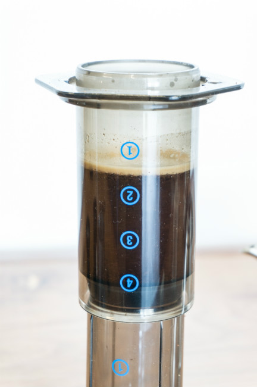
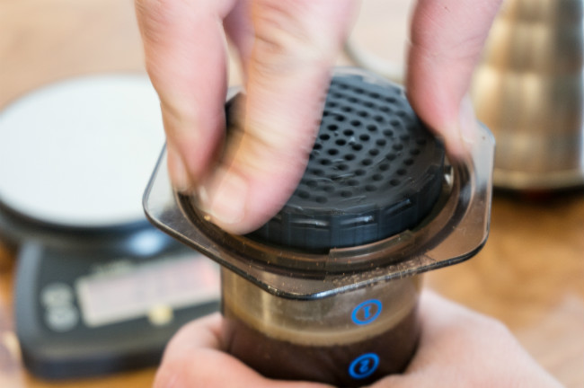
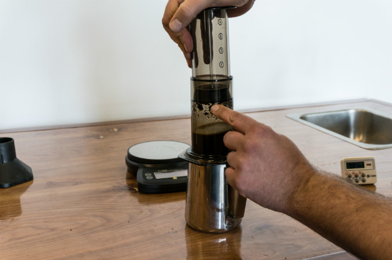

There are two main methods for brewing coffee with the AeroPress Coffee Maker. The first method is described in the directions that ship with the Aerobie AeroPress and in our [AeroPress Coffee Maker Tutorial](http://ineedcoffee.com/aeropress-coffee-maker-tutorial/). It is the regular top-down, straightforward brewing method.

The second method is known as inverted or upside-down brewing, which I will highlight in this brewing tutorial.

The experts are split on which method is best. According to Zachary Crockett’s article “The Invention of the AeroPress”, about half of the AeroPress World Championships winners use the inverted method.

### Upside Down Brewing Results in a Richer Taste

When you brew inverted, all the coffee grounds will contact the water during the brewing period. This is called full or total immersion. Full immersion brewing methods are known for having a richer taste than brewing methods where the coffee begins passing through the filter immediately. The most popular full immersion brewing method is the French Press.

### When the Standard AeroPress Leaks or Brews Too Fast

When the first version of this article was published in 2014, my AeroPress was getting old, and the seal wasn’t as strong. The coffee was leaking too fast through the brewing chamber, resulting in a weaker coffee. So, I began using the inverted method.

Using the following tips, you can minimize the chance that your standard AeroPress brew will leak or brew too quickly.

1.  Wet the paper filter.
2.  Ensure the paper filter isn’t folded and is placed evenly in the filter cap.
3.  Confirm the seal is tight.
4.  The grind might be too coarse.
5.  Use the funnel provided with the AeroPress to prevent loose grounds from entering the filter’s sealed area.
6.  Some have found that using a wider rim mug reduces the chance of leakage.
7.  If your AeroPress is old and losing its grip, consider buying a new one. My AeroPress was able to brew over 1,000 times, but eventually, it did need to be replaced.

Or you could just use the Upside Down method.

At 6 AM, I want my brewing method to be as foolproof as possible. The only way to mess up the inverted method is to lose control during the flip. There is still a possibility of leaking with the inverted method, but it matters far less since it happens at the end of the brewing period when the coffee is ready to exit the brewing chamber.

### Many Variations (Recipes) Work

The AeroPress was invented in 2005, making it very young in terms of coffee brewing methods. Since then, coffee professionals have been tremendously interested in improving the instructions Aerobie ships with each unit.

Today, there are numerous AeroPress competitions around the world. You will find a wide variance in approaches when you search for winning recipes. Brewing temperature, grind size, brewing time, and even plunge time can vary quite a bit.

At first glance, the recipes’ complexity might seem intimidating, but they shouldn’t. The fact that people are making amazing coffee using wildly different parameters tells us that the AeroPress is harder to mess up than other coffee brewing methods.

We are going to keep this tutorial simple. Once you’ve mastered the basics, you can venture out and try some award-winning recipes.

### Checklist

Before we get started, confirm you have everything.

1.  The brewing chamber of the AeroPress Coffee Maker.
2.  The plunger.
3.  Stir Paddle. Use a spoon if you lose the one that comes with the AeroPress.
4.  Black filter cap
5.  Paper filters (or you can use a reusable metal filter replacement such as the Able Brewing DISK).
6.  A kitchen scale or the scoop that comes in the box.
7.  Kettle
8.  Timer or stopwatch.
9.  Mug
10.  Coffee.
11.  Filtered or Drinking Water.
12.  (optional and not in photo) AeroPress Funnel.

### #1 Grind Coffee and Heat Water

A single AeroPress scoop is equal to 2 tablespoons or about 17 grams. Measuring coffee by volume will be less precise than by weight. The article [Why You Should Use a Scale to Brew Coffee](https://www.seriouseats.com/why-you-should-use-a-kitchen-scale-to-measure-coffee-coffee-brewing-equipment) makes a good case for tossing your scoop and grabbing the scale.

Although I agree with the article, the AeroPress is very forgiving of a few grams of variation in brewing. Don’t think that not having a scale will keep you from brewing excellent coffee.

Aerobie advises a grind between drip and espresso. I use a drip grind, while others use a coarser grind. When it comes to the grind size, the AeroPress is super forgiving. As a general rule, the finer you grind, the shorter your brew time will be.

### #2 Setup the AeroPress in an Inverted Position and Add Coffee

Place the plunger facing up on the counter. Now, turn the brewing chamber upside down and secure it onto the plunger. You want the stopper to rest in the middle of the #4 position.

If you are concerned about messing up the flip, you can push it down further so the entire #4 is below the stopper. Other recipes say the entire #4 should be above the stopper, but in my opinion, this is too unstable. One bump, and you have a hot mess to clean up.

Add the ground coffee. If you still have the AeroPress funnel, use it. I threw mine away, but I kind of wish I hadn’t because the funnel makes it easier for all the coffee grounds to get inside the brewing chamber and not get stuck on the rim of the brewer.

### #3 Insert and Rinse the Filter

Place a filter inside the filter cap and rinse with water. Set it aside for now.

### #4 Start the Timer, Add Hot Water and Stir

How hot should the water be for AeroPress brewing? Opinions vary quite a bit. Most of the recipes say to use 200-205°F, but Aerobie recommends using 175°F. From the Aeropress FAQ:

> Books often recommend a brewing temperature of 195° F to 200° F (91° C to 93° C). This is good for conventional brewing methods that pass hot water through a bed of coffee. In this method, the water rapidly cools so the lower part of the bed is operating at a lower temperature. However in the AeroPress all of the coffee particles contact the same water temperature during the stirring phase.

The top 3 finishers at the 2014 World AeroPress Championships used brewing temperatures of 174°F (78°C), 197°F (92°C), and 180°F (82°C). In previous years, you had winning recipes that were just off boiling. The lesson here is that the AeroPress can be brewed at various temperatures.

To keep things simple, I boil water and let it cool for 20-30 seconds. If you have a programmable kettle, experiment.

Start the timer.

There are two schools of thought on adding hot water and stirring.

1.  Add half the water, stir, and then add the remaining water.
2.  Add all the water and stir.

Although I’ve heard compelling arguments that #1 is better, I have done it both ways and can not tell a difference. The important thing about this step is to ensure all the ground coffee is in contact with water. Try it both ways for yourself.

Because I use a more snug fit, I fill the water halfway between the #1 and #2 circle.

### #5 Secure the Filter Cap on the AeroPress

Hold onto the AeroPress where the two chambers meet and with your other hand, screw the filter onto the brewer.

### #6 At 60-90 Seconds, Flip and Press

You can use many different brew times. A good starting range is 60-90 seconds in total. When this time has passed, grab the AeroPress, holding both chambers together, and flip it so it is over your mug.

Press down the plunger once the AeroPress is back right-side-up and over the mug. Use a slow, steady press. It should take about 20 seconds to press fully.

### #7 Add Water to Taste

What you have now is a coffee concentrate. Add some hot water to bring it to the consistency of brewed coffee. Typically, this means adding 50% water. If you want an iced coffee, just pour over a cup of ice cubes.

I should also add that you don’t need to add anything if you want to have an “espresso-like” beverage. Because the AeroPress can not generate near the pressure of a true espresso machine, I do not consider it espresso. Nor does home coffee roasting retailer Sweet Maria’s. From their AeroPress page:

> Illy’s research shows that espresso is a beverage brewed at 7-11 bars of pressure, with water temperature between 194 and 203 F (without temperature loss from a cold coffee handle, etc). Even if the AeroPress had the organoleptic features of espresso, and the appearance of espresso, I don’t think it is within these parameters.

If you go the “espresso-like” route, you can experiment using less water, a finer grind, and a shorter brewing time.

### The Most Forgiving Brewing Method Ever

I’ve tried many different methods for brewing coffee; none are as forgiving as the AeroPress. You can brew using various grinds, temperatures, and dosages and still make excellent coffee. You can even flip it upside down, and it excels.

### Resources

[The Invention of the AeroPress](https://priceonomics.com/the-invention-of-the-aeropress/) – Excellent article by Zachary Crockett.

[AeroPress Coffee Maker Tutorial](http://ineedcoffee.com/aeropress-coffee-maker-tutorial/) – Original INeedCoffee tutorial.

[AeroPress FAQ](https://aeropress.com/pages/faq) – Page by Aerobie.

[Aero Press Brew Instructions](http://web.archive.org/web/20140815175005/http://www.sweetmarias.com/aeropress/aeropress_instructions.php) – Article by Sweet Maria’s comments about why he doesn’t feel the brewer qualifies as an espresso maker at the end.

*Brewing photos by Joseph Robertson of Extracted Magazine, a digital coffee magazine published for iOS and Android.  
*