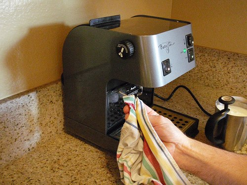

The Starbucks Barista home espresso machine is easy to use and is capable of producing high-quality espresso. This is a very good, compact, sturdy machine capable of delivering a consistent shot of espresso and good quality steamed milk. It is also available at a relatively reasonable price.

### The Design

The Barista is very simple in design. There are two push buttons on the right-hand side of the machine and one on the left. Also on the left side is a wheel used to deliver steam or hot water through the wand. There is a water reservoir and a tube that resides in the tank area for water uptake. The Barista comes with a portafilter (the part with a handle), two different baskets (one is for use with the espresso “pods”, the other is for use with loose espresso), and a measuring scoop.

### Fill The Reservoir

Pull out the water reservoir before using the Barista espresso machine, as shown in the picture. A trick I use to ensure there is water without pulling the tank out completely is to place a ping pong ball or two into the reservoir. It is easier to examine the water level by seeing how high the ping pong balls are floating rather than trying to judge the water level through the glare on the smoke-colored plastic. After filling the reservoir with water, slide it into place while making sure that the water intake tube is gently placed inside the tank.

  
*Using Ping Pong Balls to See Water Level*

  
*Fill the Water Reservoir*

### Turning It On

The left button turns on the machine. Depress the button, and the button turns red. Wait for approximately 40 seconds for the machine to warm up. The warming process is complete when the green light on the right side of the machine is illuminated.

  
*Powering On the Barista Machine*

### Preparing the Milk

Frothing milk is an essential attribute of a good barista. And, since you own a Barista machine, you can perfect this art in the comfort of your own home. If you’ve decided that you are enough of an espresso lover to buy an espresso machine, you should probably spend a few more dollars and get a straight-walled metal pitcher and a thermometer. Fill the pitcher with the appropriate amount of cold milk (right above freezing). Do not fill the pitcher to the rim, or it **will** overflow. Never reheat milk.

  
*Frothing Milk*

### Clear the wand?

Depress the button on the lower right of the machine to prepare steam for frothing. The green light will turn off. Wait a few seconds, and the light will illuminate again. With the steam button depressed and the green light on, place the steaming wand just below the milk line, then turn the knob on the left side of the machine. This will shoot the steam out of the wand. You will actually be able to hear the sound of air getting injected into the milk.

The first few seconds of heating the milk are very important. It is during this time that you can create the most froth. The best froth is dense with tiny bubbles. When the milk reaches around the 80F mark, slip the steaming wand down the side of the metal pitcher, deep into the milk. The milk should start swirling around the wand. Continue heating the milk to the 140F – 160F mark. If you heat the milk any higher than 160F, it will lose its sweetness and scald your tongue.

  
*Clean the Frothing Wand*

When you have steamed the milk, pull it away from the steaming wand and simultaneously turn the knob to the “off” position. When you are done, quickly and carefully wipe the wand with a clean, wet washcloth to get rid of the milk residue. Then, turn off the steam button by pressing it again. Swirl the milk in the pitcher after you’ve heated it. If there are large, visible bubbles, tap the metal pitcher on the countertop to settle the bubbles. The ideal state for the frothed milk is thick and velvety. Set the milk to the side and prepare to pull your shots of espresso.

  
*The frothing wand is now clean.*

### Priming the Pump

If you have just finished steaming milk, wait for the light to turn green again. Next, place the portafilter under the brewing group while it is empty. Press the top-right button to bring a shower of hot water into the portafilter. This serves to warm the portafilter and prime the pump. It makes a real difference in the quality of the shot, so don’t skip this step.

  
*Prime the Pump*

### Tamping the espresso

For more information on the importance and art of tamping, read the [Espresso Tamping Visual Tutorial](http://ineedcoffee.com/espresso-tamping/). Once you’ve filled the portafilter and tamped the espresso, align the handle so that it is about 45 degrees to your left, and insert it into the group head. Then, twist the handle back so that it fits tight.

### Pulling the shot

You are now ready to pull your first doppio or double espresso. For measurement purposes, you should purchase espresso glasses or metal cups that denote the one-ounce mark. Measure the time that it takes to pull the shot until it is second nature to you. The total time should be 15 – 18 seconds for a ristretto and 18 – 23 seconds for a regular shot. If you time your shots precisely, you can brew directly into two demitasse cups without the need to measure and re-pour. If your machine is pushing out the espresso at a faster rate, you should use the group tightener to tighten the screw on the underside of the group head. This will restrict water flow to ensure that the espresso is brewed properly.

  
*Pulling Espresso Shots*

### Using the Espresso

-   If you want straight espresso, just pour the espresso into demitasse cups.
-   If you are making an Americano, pour your espresso into a mug. Now, put the clean frothing wand into the mug and turn the knob (don’t push any buttons this time). This will shoot hot water into your espresso. Fill to the desired strength.
-   If you are making a cappuccino or latte, you can now pour the espresso into a cup, mug, or glass and pour the frothed milk on top of the espresso.

  
*Making Cappuccino*

In addition to the basic recipes we have covered here, you can make many more creations with espresso and the Barista espresso machine. Don’t stop experimenting — if you stumble upon greatness, let INeedCoffee.com know, and we’ll publish your work.

### Resources

[Espresso Tamping Visual Tutorial](http://ineedcoffee.com/espresso-tamping/) – Guide to tamping espresso.

[1998 Starbucks Barista home espresso machine demo tape](https://www.youtube.com/watch?v=3X5i2SZ9zGM) – YouTube

CREDIT: All photos by Anil Das of San Diego, California.