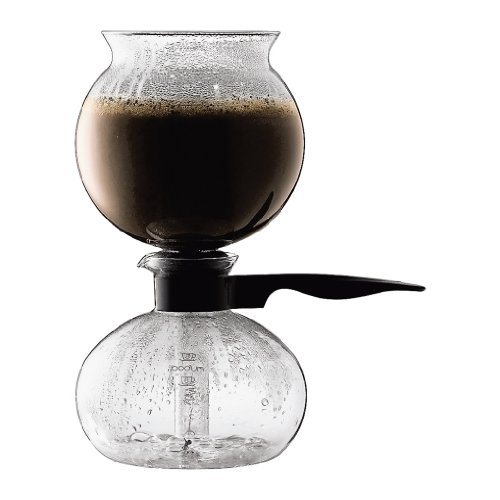
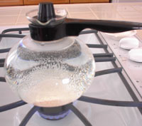
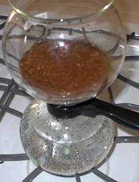
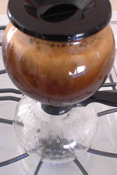
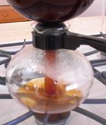
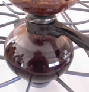

The Bodum Santos vac pot will produce really wonderful coffee if you can learn to operate it properly. Vac pots, in general, produce a coffee that is every bit as rich as French Pressed coffee, but is less gritty in the cup. This unit is designed for use on a stove burner or alcohol lamp. Priced under $50, this unit is an affordable way to discover the joys of vacuum brewed coffee.

  
*Bodum Santos Stovetop Glass Vacuum 34-Ounce Coffee Maker  
*

### Setting Up the Vac Pot

The setup for brewing coffee with the Santos is very similar to other vacuum brewers. Begin by putting the water in the lower chamber or carafe of the brewing unit. Next, set it on the burner and begin heating at medium heat. This is perhaps the most important factor in vacuum brewing in general. A gentle, even heat will help the process. The Bodum comes with a lid to put on the carafe while heating, which helps retain a bit of heated water vapor.

  
*Heating water for the vac pot coffee.*

### Prepare the Coffee

While the water is heating, go ahead and set up the top chamber by affixing the filter so that it is centered around the hole. Then add your coffee (ground to auto-drip) to the top and spread it around evenly. By now, the water in the carafe should be warming up gently, and we can affix the top portion of the brewer to the bottom. Make certain you have the two pieces joined evenly so that a proper seal is made, being careful not to force them together too tightly.

  
*Vacuum Pot coffee brewing starts.*

### Watch, Swirl, and Wait

The next step is to wait and watch the brewing process. Slowly and surely, the level of the water from the bottom will rise through the glass tube into the upper chamber. When the coffee grounds become saturated with water, I like to take a knife or spoon and gently swirl the water and the grounds to make sure none of the grounds float above the water without being extracted by the water. After this is complete, I like to place the lid on the coffee brewer and wait for the magic moment when most of the water from the bottom is gone and the brewing process is completely rolling above.

### Active Brewing and Settling

  
*Vac-Pot coffee brewing is in progress.*

When the rolling happens, let it continue for around 30 seconds or so, and then remove the entire unit from the heat. In a few seconds, after the heat has been removed, the coffee should slowly make its way to the bottom and into the carafe.

  
*The vac-pot coffee drops to the lower chamber.*

  
*Vacuum Pot coffee is now finished brewing.*

### Conclusion

Now that the coffee has been fully brewed, all that is left to do is carefully remove the top chamber, place it in the holding stand, and pour yourself a mug of coffee. Overall, this device operates similar to the Yama Syphon and is priced similarly, with some differences in filtration and brewing capacity.