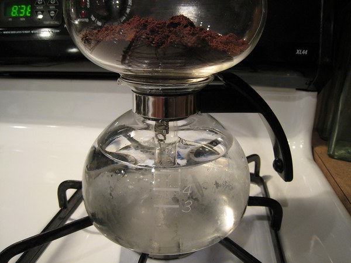
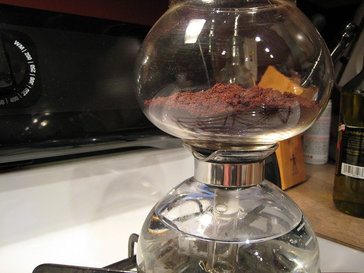
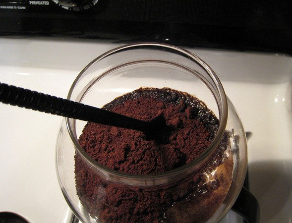
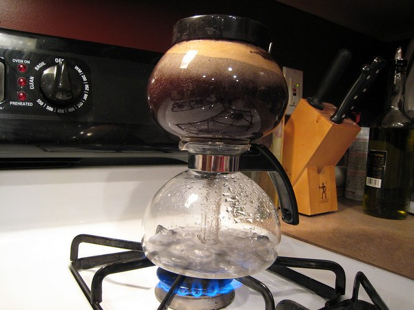
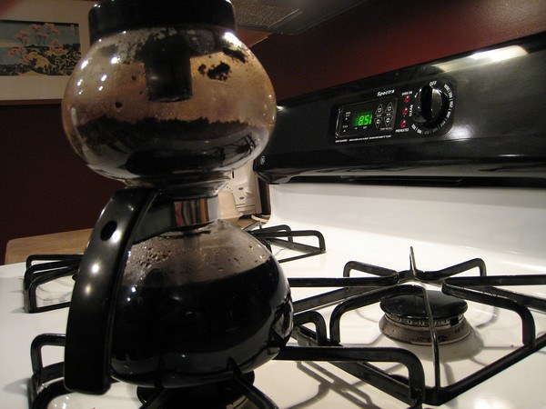
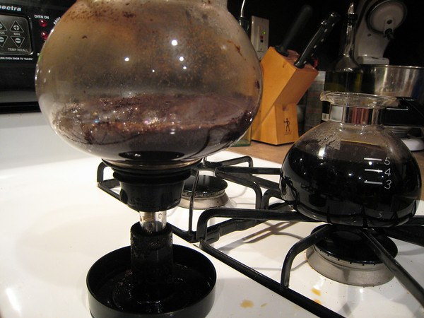

While I haven’t personally used other stovetop vacuum brewers, I have heard mostly horror stories of plugged filters, slow/incomplete brewing, bad seals, etc. The Yama Syphon (Yama Siphon) brewer has shown none of these symptoms for me. I have also found this extremely easy to use and clean up. Of course, usability is worth nothing if the result tastes horrible. Here, too, the Yama does very well. Properly used, the coffee you brew will be richer than a French press and without all the extra sediment. It will be incredibly smooth.

### Preparing the Coffee

The coffee for this brewer should be ground just as you would for an automatic drip coffee maker. The amount of coffee you use will vary to taste, but I recommend between 3 and 4 tablespoons to start with. Next, place the filter disc into the globe so that the spring hangs down into the glass rod. Pull the chain and ‘hook’ it around the bottom of the glass rod. After this is assembled, place the coffee into the top of the globe and spread evenly.

  
*Preparing the Yama Syphon.*

  
*Vac-Pot Coffee brewing*

### Filling With Water

Fill the Yama Siphon to the “5” setting at most. I have heard that you can slightly overfill it, but I have had some boilovers occasionally when doing this. Next, place the *diffuser* on your electric burner. Turn the stove to medium heat only.

Don’t be tempted to turn it up higher in order to heat the water faster.

You can measure with a thermometer the temperature of the water as it heats and wait to place the top globe on until a certain temperature that you prefer. Or you can assemble the unit at once. I prefer to assemble the unit early.

### Watch Vac Pot

As the saying goes, *a watched pot never boils*, but in this case, that is a good thing. With vacuum coffee, the water doesn’t actually boil. It is really quite fun to watch the brewing process. It begins slowly as some of the water escapes the building pressure in the lower chamber by traveling up through the glass tube and into the top chamber.

  
*Stir the coffee grounds.*

  
*Yama Glass Coffee Siphon  
*

As long as there is a little bit of water in the Yama Siphon’s bottom chamber, it will continue to generate vapor pressure to push heated water into the top chamber. When the water is kind of gurgling in the bottom (when the level has gone below the top of the glass rod), let this action continue for about 30 seconds. Then, remove the unit from the heat source and wait for the water to filter back down through.

  
*The Yama Syphon coffee is now finished brewing.*

### Let Vac Pot Cool Down

Before you disassemble the Yama Syphon, let the top of the glass globe cool down for at least a minute. Then, carefully remove the top by gently rocking the globe until it is free. You can now remove the lid and turn it upside down to use as a stand for the globe while you pour the coffee.

  
*Allow the glass tube to cool before you disassemble.*

### Conclusion

Overall, the Yama Syphon provides a really great cup of vacuum-brewed coffee at a reasonable price. It works well on an electric stove, which can’t be said of other units in its class. I believe the secret is the cloth filter, which doesn’t get plugged up and does an excellent job of filtering.

These filters, however, are also the main problem, as they are hard to come by without buying a new unit. It would be easy to create these out of linen cloth using your current filter as the pattern. I haven’t tried this, but I have heard it works fine.

### Resources

[Vacuum Pot Brewing](/vacuum-pot-brewing/) – Article by Ryan Jacobs that highlights different vac-pot brewers.

[The Coffee Siphon – The Simple Tutorial](/the-coffee-siphon-the-simple-tutorial/) – A basic coffee siphon tutorial.
