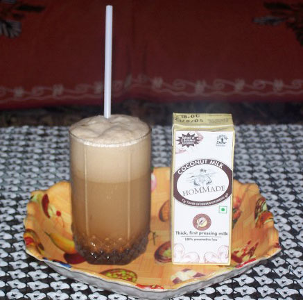

Since I became a vegan 4 years back, I was afraid to lose my favourite Cold Coffee’s taste. So I decided to give it a try without using dairy. I came out with wonderful and nutritious cold coffee. You can also try to use Soya Milk in the place of Coconut milk. Try this Vegan Coffee even if you are not Vegan. Yum Yum.

### Ingredients (for 4 glasses)

-   300 ml coconut milk.
-   1 teaspoon Coffee or as your taste.
-   1 teaspoon Cocoa powder.
-   Brown Sugar/Jaggery according to your taste.
-   10-12 Ice cube.
-   1 cup drinking water.

  
*Vegan Cold Coffee*

### Procedure

Blend all till you get good foam in the mix. Then serve it. Don’t forget to make toppings with foam.
