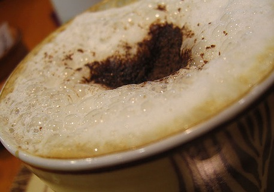
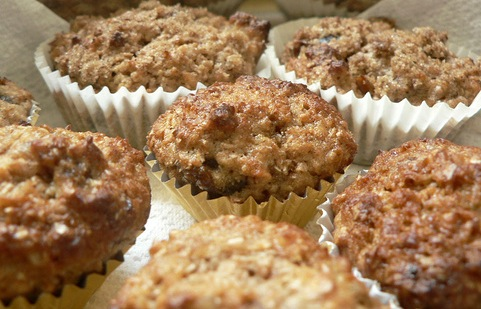

### Viennese Coffee – (Hot) 4 servings

INGREDIENTS:

-   1/2 cup chocolate
-   2 1/2 cups strong coffee
-   4 tablespoons light cream
-   2/3 cup heavy cream
-   1 teaspoon sugar
-   dash of cinnamon
-   dash of cocoa

  
*Viennese Coffee*

PREPARATION:

1.  Melt chocolate in a saucepan
2.  Stir in a light cream
3.  Slowly add coffee, beating until frothy
4.  In a cold bowl whip heavy cream and sugar
5.  Pour coffee mixture into cups
6.  Top off with heavy cream

Garnish with a sprinkle of cinnamon and cocoa

### Cappuccino Muffins

INGREDIENTS:

-   2 cups all-purpose flour
-   1/2 cup sugar
-   2-1/2 teaspoons baking powder
-   2 teaspoons instant espresso coffee powder (or instant coffee)
-   1/2 teaspoon salt
-   1/2 teaspoon cinnamon
-   1/4 teaspoon nutmeg
-   1 cup whole milk
-   1/2 cup butter, melted and cooled
-   1 egg, slightly beaten
-   1 teaspoon vanilla extract

  
*Cappuccino Muffins*

PREPARATION:

1.  Preheat oven to 375 degrees F. Line muffin tins with papers or grease liberally.
2.  In a large bowl, whisk together flour, sugar, baking powder, espresso or instant coffee, salt, cinnamon, and nutmeg.
3.  Set aside.
4.  In a medium bowl, mix milk, butter, egg, and vanilla until combined. Stir milk mixture into flour mixture only until combined. Do not overmix.
5.  Fill muffin cups 3/4 full. Bake 15 to 20 minutes for standard muffins or 10 to 12 minutes for mini-muffins. Cappuccino muffins freeze well.