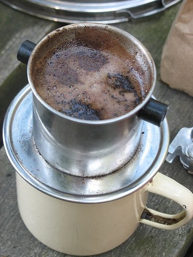

In America, it seems we try to do everything so fast. We have a drive-through, pre-made, just microwave, fast food kind of lifestyle. Here is another coffee idea to let you stop for a minute or two and enjoy some quiet time, or just spend some time with friends.

The coffee culture of Vietnam stems from a time when it was a French colony, but it also has deep roots within itself, being the fourth largest coffee exporting nation. If you visit a Vietnamese restaurant and order coffee, you might be surprised when they bring you a cup, partially filled with sweetened, condensed milk, and some hot water. Where’s the coffee? You make it fresh, right at your table.

  
*Photo by [Sue Richards](http://www.flickr.com/photos/suerichards/227557760/)*

The gadget that makes this work is the Vietnamese coffee press. It is a little metal cup, perched on top of the coffee cup. It is perforated with tiny holes in the bottom, acting as the filter.

In the restaurant, they will have already added a few teaspoons of coffee, and traditionally, this will be a blend of dark roasted coffee and roasted chicory. They tighten the filter down over the coffee (it screws into the bottom part), add the sweetened, condensed milk to the coffee cup, and present it to you.

Taking the just below boiling water, fill the little metal cup 1/4 of the way full. After this has dripped through, you loosen the filter for two full revolutions and then fill it to the top, which takes about 4 ounces of water. It should then take about 4 minutes for this to completely drip through.

After this is complete, stir to mix the white, caramel-like sweetness at the bottom with the black, strong coffee goodness at the top. It should resemble rich, creamy, smooth, melted coffee ice cream. While you can drink it hot, which would be called **ca phe sua nong**, traditionally, it would be poured over ice, which is called **ca phe sua da**. Take a trip to a Vietnamese restaurant and enjoy.

### Resources

[Vietnamese Coffee](http://ineedcoffee.com/brew-vietnamese-coffee/) – A step-by-step brewing tutorial.

[Vietnam: Silent Global Coffee Power](http://ineedcoffee.com/vietnam-silent-global-coffee-power/) – Article on the rise of Vietnam as a major coffee exporter.