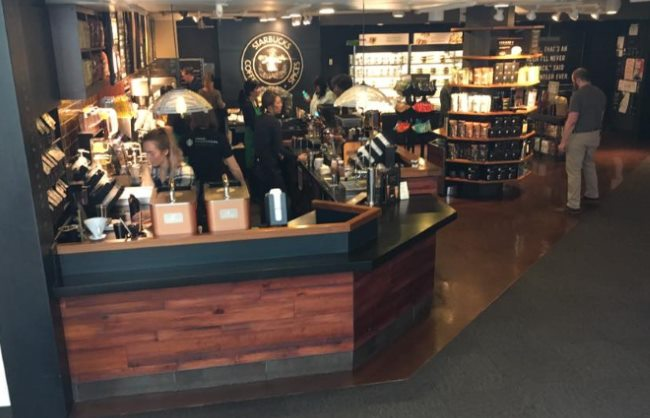
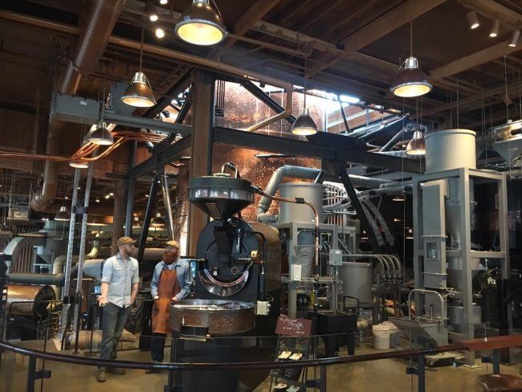

*This article is excerpted from the newly released book Holy Grounds: The Surprising Connection Between Coffee and Faith — From Dancing Goats to Satan’s Drink (Fortress Press).*

Full disclosure: I’ve always had a love/hate relationship with Starbucks. Okay, mostly a hate/hate relationship because I just don’t enjoy their coffee. I understand how they played an integral role in shaping American coffee culture, but I don’t appreciate darkly roasted coffee served at scalding temperatures. Not my thing. So I admit to being slightly wary of, if grateful for, the invitation to visit the Starbucks mothership in Seattle.

I was on sabbatical from my real job as pastor of a congregation on Boston’s South Shore, researching a book on the intersection of coffee and faith. I figured, besides visiting coffee farms in Central America, drinking espresso in Rome, and hanging out with coffee roasting monks in Pennsylvania, I should make a pilgrimage to Seattle, the ground zero of the American coffee revolution.

While you can simply wander into one of nearly thirty thousand Starbucks worldwide, you can’t just show up at Starbucks headquarters and expect to gain admittance to their corporate offices.

Fortunately, a parishioner of mine works with Starbucks in some vague financial services industry capacity, and he pulled a few strings to get me a tour.

My childhood friend Kevin Daniels, who moved to Seattle from Baltimore nearly twenty-five years ago, joined me on this excursion. He’s become a coffee aficionado himself over the years, although I was surprised to learn he doesn’t wear plaid shirts every day and listens exclusively to concert bootlegs of Nirvana.

Pulling up to the corporate headquarters is impressive in itself. Housed in a massive red brick building constructed in 1912 in Seattle’s industrial district, it was formerly owned by Sears Roebuck and Company. Rechristened the Starbucks Center in 1997, it’s topped by a clock tower over which looms the top half of the familiar green mermaid in a sort of Kilroy Was Here vibe. While most independent coffee shops are run out of a small back office within shouting distance from the whir of the espresso machine’s steam wand, that’s not how Starbucks operates. Starbucks brews a unique blend of corporate and coffee culture.

*Starbucks HQ*

Following proper vetting and the issuing of official visitor badges, Kevin and I were met by our gracious hosts. The corporate loyalty displayed by everyone we encountered was astonishing. I won’t reference Kool-Aid, since we’re speaking of coffee and want no negative connotation, but people who work at Starbucks are passionate about both coffee and the company’s mission. Starbucks remains uniquely qualified and positioned to influence the global coffee industry, and they take that responsibility seriously.

What amazed me most was visiting the employees-only, fully staffed Starbucks nestled in between the offices. From human resources managers to executive secretaries to bean counters (not those beans) to quality-control tasters, this is a well-caffeinated workforce. Granted, I couldn’t help but think about the poor baristas who had to work there. They were friendly, highly competent, and probably the crème de la crème of the barista population, but it induced nightmares of having to preach to a church full of pastors. Not that coffee folks would be as judgmental as fellow clergy, but still!

Don’t tell anyone, but in addition to the regular Starbucks menu items, the in-house operation also offers special coffees not available in the regular stores. I had a Nicaraguan single-origin coffee expertly brewed on an $11,000 Clover brewing machine, which is basically like a French press in reverse without the nasty grounds getting into the cup. Or as our guide put it to me as I stared in rapt wonder at the Clover in action, it’s like “drinking coffee in high definition.” And it was.

*In House Starbucks*

Starbucks is unlike any other coffee company in the world in terms of its market share, number of employees, and the sheer volume of coffee sourced, roasted, brewed, and served. Yes, they maintain their status as a hugely profitable global corporation. You may or may not love their coffee, and you may or may not love their methods, but there are people from Howard Schultz on down trying to make a difference in the lives of those up and down the coffee supply chain, and I was immensely grateful for this unique look at the operation.

After bidding farewell to our hosts, Kevin and I made our way to the new Starbucks Reserve Roastery and Tasting Room in Seattle’s vibrant Capitol Hill neighborhood. I was particularly keen to visit the Roastery, as even battle-hardened coffee-industry professionals speak glowingly about the place’s sleek design and technological prowess.

Starbucks has opened several of these new concept stores in various markets worldwide. The original one is in Seattle, naturally, on the famous Pike Street, just nine blocks from the original Starbucks.

The Reserve Roastery is many things: pilgrimage site for Starbucks lovers; a mind-blowing coffee experience for people enamored with different brewing techniques like siphons and pour-overs and unique coffee drinks not available at your neighborhood Starbucks; technological wonder with massive roasting machines tended to by guys with huge beards and handlebar mustaches; laboratory with ornate cold-brew systems that look like something out of the mind of a mad scientist; a coffee museum with displays about coffee-growing regions and processing techniques. Imagine the coffee equivalent of a mashup between Walt Disney World and Studio 54, and you get the idea.

*Starbucks Reserve Roastery*

The concept behind the Reserve Roastery stores is to return to what Howard Schultz talks about as the “theater of coffee.” These are meant to be destinations, not drive-throughs; places that emphasize coffee as an experience, not just a caffeine fix. I think there’s also an attempt to bring in consumers who feel Starbucks has gotten away from its original core commitment to quality coffee. The Reserve concept seeks to introduce consumers to a rotating array of small-lot coffees from places like Ethiopia, Jamaica, Brazil, and Guatemala.

*Roasting Coffee at Starbucks Reserve*

A major educational goal connects coffee drinkers with particular farms and farmers in ways that can’t happen when you order a Blonde Roast or Pike’s Place, which blends coffees from farms all over the world. The average Starbucks coffee is, to my tastes, over-roasted because the consistency of flavor is valued more than subtly. That’s simply the reality for a company that churns out four billion cups a year and wants that grande Verona blend you purchased at the Starbucks in Seattle to taste just like the Verona you ordered at the airport in Boston before you boarded the plane.

As with everything Starbucks, just as many people will flock to the Reserve Roasteries as will condemn them, and in the end, Starbucks stockholders will be rewarded.

### Resources

*Holy Grounds: The Surprising Connection Between Coffee and Faith — From Dancing Goats to Satan’s Drink*

[Starbucks Coffee College](/starbucks-coffee-college/) – INeedCoffee article about attending a coffee education program hosted by Starbucks.

[Starbucks Reserve Roastery](https://www.starbucksreserve.com/) – Official site.
