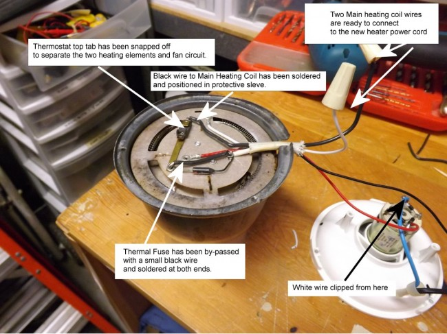

I was inspired to buy the [West Bend Poppery 1](http://ineedcoffee.com/roasting-coffee-in-a-popcorn-popper/) when I saw *willbldrco’s* video on YouTube entitled *West Bend Poppery rewire for coffee roasting*. What a masterful modification to simply solve the coffee roasting routine by changing one wire to another terminal.

By changing the fan wire to the hot terminal, so it would bypass the off-on switch and the fan would run all the time when the popper was plugged into the socket, is sheer genius. This means that the off-on switch, on the popper, can now be used to control the heat; thereby regulating the temperature and prolonging the roasting time of the beans.

An even better solution was provided by Jim West in his West Bend Poppery 2 modification effort. He put the fan on a separate DC current circuit using a transformer from Radio Shack. This allowed the heat to be controlled by a router speed control unit from Harbor Freight. He separated the small heating coil and the main heating coil into one circuit and put the fan on the other transformer circuit.

### My Alternative Solution

My alternative solution is to keep the small coil and the fan in one circuit; the small coil acts as a voltage reducer, and by isolating the Main heating coil in another circuit, the need for a transformer is eliminated. The fan and small coil will run when the circuit is plugged into the 120-volt outlet. The main heating coil will be wired into a separate circuit with its own plug-in wire that can be controlled with the Harbor Freight Router Speed Control, which is plugged into a separate 120-volt outlet.

The photograph below shows the items needed to make the alternative conversion outlined above.

A $1.69 extension cord, after it is cut in half, will provide the new plug-in cord for the main heating coil. The black wire will provide a connection to one end of the main heating oil, and the small black shunt wire will bypass the thermal fuse, so the fan cannot be shut off by overheating. The rubber grommet for $ 0.70 will make a neat entry job for the new main heater cord. The two-wire connecting nuts will provide the connection to the Main heating coil wires.

### The Conversion

This conversion will work not only on the West Bend Poppery 2 but on most of the [Presto hot air poppers](http://ineedcoffee.com/poplite-coffee-roaster/) with similar wiring. The one cautionary provision in this modification is to make sure the two circuits are completely separate. Some hot air poppers have a small coil connected directly to the main heating coil. If the popper is so wired, then the small coil must be separated from the main heating coil. It should be connected to a point somewhere on the fan circuit so it is in series with the current to supply power to the fan. This should only be attempted by someone who knows what they are doing.

The WB Poppery 2 is disassembled by removing three screws in the top cover of the popper. The power cord is removed by twisting the power cord keeper fitting 90 degrees to the right or left and then pulling it out. The cord keeper can be removed and saved for later re-assembly using the reverse procedure. The heating and fan unit are disassembled by removing three small screws that hold them together. When you have performed that task the internal working of the heating unit can be explored. Mark the orientation of the parts so that reassembly will be easier.

Point A is the incoming 120-volt hot wire. The current moves from A through the Thermal Fuse to D to supply both the small and main heating coils. D is one end of the small heating coil, and E is the other end of the small heating coil. This supplies power to the fan. Current then runs down the brass strip from D to the thermostat and supplies current to C, which is one end of the main heating coil. By removing the top part of the thermostat (and the bi-metal disk), we isolate the two heating coils. The white ground wire is attached to the other end of the Main heating coil. It is cut from the incoming 120-volt ground connection.

In the photograph below, before the removal of the thermostat tab, I propped open the thermostat contacts with a toothpick. I tested to make sure there was no contact between the two coils with a continuity meter. When the white ground wire to C has been clipped, the separation of the two coil circuits is complete. The fan and the small coil are on the original popper cord. The white wire at B and the new black wire at C will be attached to a new power cord to supply power to the Main heating coil.

### Near Completion

There will be continuity between B and C. There should be **NO CONTINUITY** between B and/or C and any other points of the fan and small heating coil circuit. If this checks out, the heating and fan unit are now ready for reassembly. Take care to orient the two parts correctly when you reassemble them.

In the photograph below, a hole has been drilled into the outer case of the West Bend Poppery 2, the rubber grommet inserted into the hole and the new Main Coil power cord threaded through.

The two main heater coil wires are connected to the new cord with wire nuts, and then the West Bend Poppery 2 unit is reassembled. The original power cord is refitted with its keeper plug. The wires are marked for heat and fan.

### Take Notice of This

This unit is now unprotected from overheating. **Do not operate the Modified West** **Bend Poppery 2 without the fan plugged in and running**. The fan cord can be plugged directly into the 120-volt outlet. The heater cord can be plugged into the Router Speed Control. The router speed control can be plugged into a 120-volt outlet. If the heat is on for **5 seconds without the fan** on the West Bend Poppery 2 will **melt down and catch on fire. It will be trash or worse!**

The unit has enough power to roast coffee with the fan on full power, and the heater coil operates at 50%, 75%, 87%, or 100% power.

### A Roast Profile to Start YOU off…

I roast 90 grams of coffee beans in about 12 minutes. I apply full power to the fan for 2 to 4 minutes with no heat to pre-warm the beans and popper. Then I add heat at 75% for 4 minutes, and then I add heat at 87% for 4 minutes, and then I finish the roast at 100% power. I use a thermometer and usually roast to a city plus or full city level and stop the roast at 230 to 235 degrees C, just into the second crack.

### Once Again, Be Careful

This unit can be **dangerous and will overheat and catch fire** if operated in a careless or unattended manner. This worked for me, and there are no guarantees or warranties. Be careful and study all the modifications and understand what you are doing before modifying any popper. Good luck and happy roasting.

### Epilogue

The Photograph below tells the story. If modified and used properly, you can enjoy many great cups of coffee, if not a lot of sadness and tears will fill your cup.

The old saying that the proof is in the pudding comes to my mind. **You can roast coffee quite well in the West Bend Poppery 2 without modifying anything.** Slowing down the roasting speed is a challenge. This can be accomplished with the router speed control and a wooden spoon to stir the beans as they roast.

Three tools I find indispensable are:

1.  Router control
2.  Flashlight
3.  Chaff collector

The router control and 4 outlet extension cord sit on my workbench for almost every project. I made the dimmer switch cord for about $10.00. It is a 600-watt dimmer switch and can handle video lights or the fan on a popper, but has limited use in controlling the heat, as it will only handle 5.5 amps.

Another nice thing to have while roasting is a chaff catcher; it makes cleanup a lot easier. I used screen wire shaped in a circle to fit the diameter of the roasting chamber, and then I stapled it on the seam. The top of the catcher is attached with longer stripped wire strands from the screen wire.

Enjoy. And thanks for your attention. SH

### Resources

Router Speed Control – Harbor Freight Tools

[West Bend Poppery rewire for coffee roasting](https://www.youtube.com/watch?v=RsAJW_yvZMM&feature=youtu.be&ab_channel=willbldrco) – Youtube video by *willbldrco.*

[Completing Hiro’s journey – Poppery II mod](http://popperyii.blogspot.com/2011/01/completing-hiros-journey-poppery-ii-mod.html) – Tutorial by Jim West.