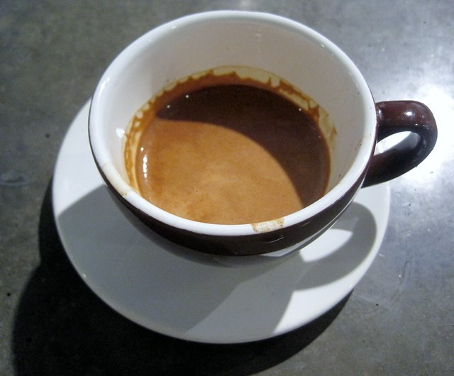
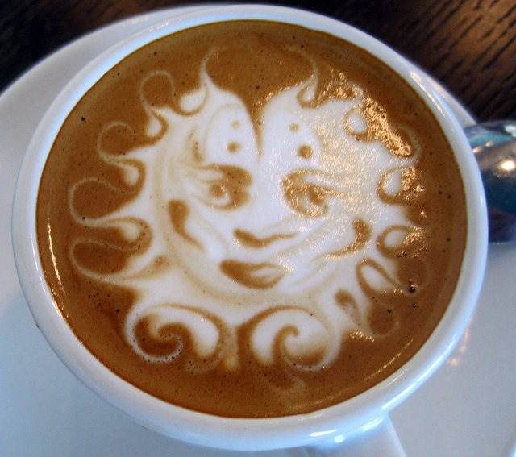
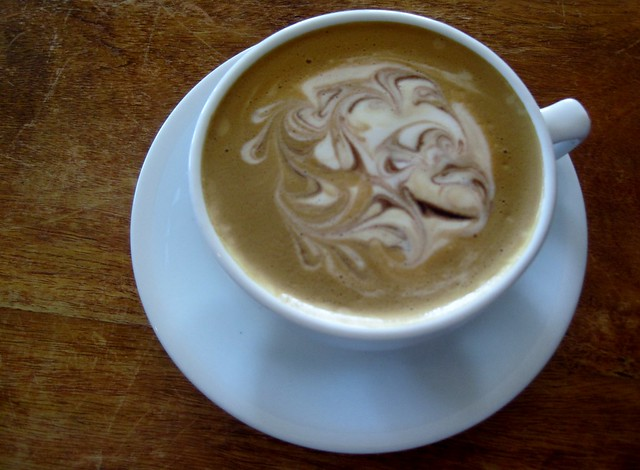
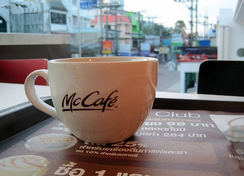

Do you like a foamy dainty cup of the steaming delight, or can’t say no to a tall hot mug of black coffee in the morning? Even scientists agree, that your choice of beverage says a lot about your personality, mood, and behavior. Those who like their latte sweet are friendly and caring by nature while those who think a foamy latte is their favorite tend to have a strong opinion on everything they care about.

So what’s your style and what does your favorite cup of coffee say about you? Here are my thoughts on the subject. And yes, this is just my personal opinion and observation and is not based on any scientific research for study!

### Cappuccino

You like your coffee frothy, and milky and in real life too, you enjoy the little pleasures of life to their fullest. Cappuccino is usually the first type of coffee that people start with, and many religiously end up having it as their morning essential. Cappuccino drinkers also like to soften the bitterness of coffee and don’t always care about themselves and instead go out of the way for others.

### Espresso

Your no-nonsense, purist, and sensible personality sets you apart. Just like your coffee, you are straightforward, patient, and efficient, and like to always keep things simple. However, you can also be resistant to change and even act moody and abrupt at times.

  
_Street Bean Espresso by INeedCoffee_

### Latte

One of the most-loved forms of coffee, the Latte is highly preferred, and latte-lovers are great friends and fun to be with. They are also known to be generous with their time.

  
_[Latte Art Etching](/latte-art-etching-photo-gallery/) by INeedCoffee_

### Mocha

Mocha is a close cousin of both coffee and hot chocolate. Mocha drinkers are perfectionists, trendsetters, and spontaneous. Mocha has a sweet and bitter chocolate flavor and people who regard mocha as their favorite flavor of coffee also like the blend of sweet and bitter in their lives.

  
_Cafe Cuzco Mocha by INeedCoffee_

### Latte Macchiato

Strong, distinct, and intense, the Latte Macchiato is an experimental blend of coffee that partners richness and originality all in one. Latte macchiato is an unconventional choice of coffee and is a lot like the original bitter black coffee. If that’s what you order, it depicts a strong, headfast, and purist personality.

### Americano

You love to aim high and have high aspirations in life. Your choice of pure and honest flavors is evident in your personality as well.

  
_[Americano in Thailand](https://criticalmas.org/2010/05/sleepy-starbucks-and-caffeinated-sins-in-phuket-thailand/) by MAS_

Interesting results, don’t you agree? So next time you are in the mood for coffee, just stop and think for a minute – do you order your coffee or does your coffee order you? Try out the diverse flavors of the world’s most loved beverage at your home today.

### Resources

[Coffee Brewing Guide](/coffee-brewing-guide/) – Tutorials on how to make coffee with different brewing methods.

[Latte Art Etching Photo Gallery](/latte-art-etching-photo-gallery/) – Latte Art Etching photos.

[Espresso Tamping Visual Tutorial](/espresso-tamping/) – How to make espresso.
