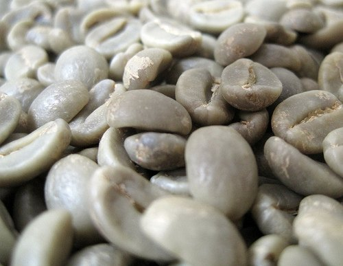
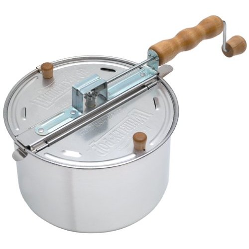

Roasting your own coffee may seem difficult, troublesome, or even a ridiculous notion. I contend that it is neither difficult nor troublesome, and the only thing ridiculous is settling for less than the best coffee possible. There are so many reasons to roast your own coffee, but I will summarize what I think are the most compelling reasons.

### The Freshness

Personally, I think the best reason for home roasting is that you have full control over the freshness level of your coffee. Having coffee at its freshest really makes a huge difference in the quality of the cup you will drink. I liken it to the difference between home-baked cookies and store-bought cookies. I guarantee that the first batch of coffee you roast in your home will taste better than the coffee roasted in Seattle two or more weeks ago or even that of your local coffee supplier. Also, consider this: right now you probably buy your coffee by the pound, so you only get to enjoy one type of coffee at a time. If you roast your own coffee, you can buy many different types and blends of green coffee. Green coffee is very easy to store, and since you can roast small batches, you can literally try a fresh, new roast each day.

  
*Green coffee*

### Home Coffee Roasting is Easy

Roasting coffee is easier than you can possibly imagine. It has been compared to boiling water or toasting bread. Just buy a small batch of green beans over the internet and locate a few, common household items. Once you have your supplies, you can have freshly roasted coffee within 5-15 minutes, depending on the roasting method and roast preference.

### Home Coffee Roasting is Economical

Green, unroasted, coffee beans generally cost half the price of what you would pay for the same kind of bean roasted. If you are an avid coffee drinker, you can really save money by roasting your own. Furthermore, unlike homebrewing kits or bread machines, you don’t have to make a large equipment investment. I started home roasting by purchasing a West Bend Poppery II hot air popcorn machine. They retail for around $20 US. There are more advanced roasting devices that you can invest in, but you’ll get great coffee from any of the available roasting methods.

### Home Coffee Roasting is a Great Hobby

Roasting coffee is a great hobby to explore. With the huge variety of coffees available, crop variations, and roasting levels, a person can dedicate a lifetime to the pursuit of coffee knowledge. With home roasting as your hobby, you can explore the artistry of creating new coffee blends, and designing roasting equipment and/or modifications.

The home roasting community is quite friendly and very, very active. This is really helpful as you become more involved in roasting and want to learn ways to fine-tune your craft. There are websites, newsgroups, and books dedicated to home roasting. Of particular interest is the Home Coffee Roasting Mailing List at Sweet Maria’s. Sweet Maria’s is regarded as the premier resource for the home coffee roaster. In addition to home roasting equipment, you can find a huge selection of green beans available for sale in small batches for very reasonable prices.

*One option is to roast coffee using a Whirley Pop on the stovetop.*

### Impress Your Friends

If nothing else, roasting coffee will impress your friends. Bringing homemade bread, homemade cookies, or even homemade beer to a party will most certainly be appreciated and enjoyed by guests. So will home-roasted coffee. When you present your friends with the freshest coffee that they have ever tasted, they will most certainly enjoy it and they are sure to hold you in high esteem. A word of warning, though: the price of this reverence is the expectation and anticipation that you will roast again and again.

### Resources

[Roasting Coffee in a Popcorn Popper](/roasting-coffee-in-a-popcorn-popper/) – INeedCoffee tutorial.
