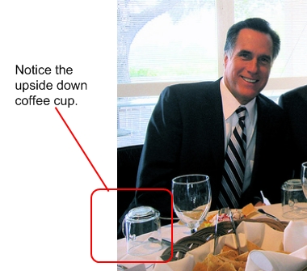
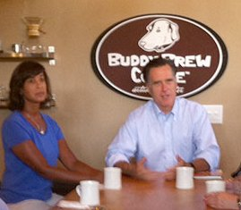

Have you noticed that most followers of the Church of Jesus Christ of Latter-Day Saints (LDS), commonly called Mormons, don’t drink coffee or tea? You’ll see them enjoying herbal teas (tisanes), hot cider, and many true believers even drink caffeinated soda. The casual observer may jump to the conclusion that this is:

1.  A law
2.  It must have something to do with caffeine.

Neither is accurate. This article explains in detail the historical significance, context, and modern interpretation of the prohibition/exhortation against coffee and tea for Mormons.

### The Word of Wisdom

Followers of the LDS church believe in a book of scripture called The Book of Mormon, and the concept of continuous revelation. They believe that the Holy Spirit continues to communicate with humans. Thus, the prophet Joseph Smith received a spontaneous manifestation of God’s insight for living correctly on February 27, 1833.

This insight was written down and incorporated into the Doctrines and Covenants of the Church; specifically, these insights are referred to as the Word of Wisdom. It may be an apocryphal story, but it is said that Joseph Smith was moved to ask for God’s insight on the matter of tobacco, and the revelation that resulted included guidance related to the use of tobacco, “warm drinks”,”strong drinks”, wine, meat, herbs, and grains.

1.  A Word of Wisdom, for the benefit of the council of high priests, assembled in Kirtland, and the church, and also the saints in Zion-
2.  To be sent greeting; not by commandment or constraint, but by revelation and the word of wisdom, showing forth the order and will of God in the temporal salvation of all saints in the last days
3.  Given for a principle with promise, adapted to the capacity of the weak and the weakest of all saints, who are or can be called saints.
4.  Behold, verily, thus saith the Lord unto you: In consequence of evils and designs which do and will exist in the hearts of conspiring men in the last days, I have warned you, and forewarn you, by giving unto you this word of wisdom by revelation-
5.  That inasmuch as any man drinketh wine or strong drink among you, behold it is not good, neither meet in the sight of your Father, only in assembling yourselves together to offer up your sacraments before him.
6.  And, behold, this should be wine, yea, pure wine of the grape of the vine, of your own make.
7.  And, again, strong drinks are not for the belly, but for the washing of your bodies.
8.  And again, tobacco is not for the body, neither for the belly, and is not good for man, but is an herb for bruises and all sick cattle, to be used with judgment and skill.
9.  **And again, hot drinks are not for the body or belly.**
10.  And again, verily I say unto you, all wholesome herbs God hath ordained for the constitution, nature, and use of man-
11.  Every herb in the season thereof, and every fruit in the season thereof; all these to be used with prudence and thanksgiving.

The common hot drinks of the time were coffee and tea. But this was a dietary shift for Joseph Smith’s contemporaries, the generation of Mormon Pioneers.

### Mormon Pioneers

Mormon pioneers had a relatively high literacy rate compared to other people around the world in the 1830s – 1850s. To a large extent, this can be attributed to the fact that they had Protestant roots and they needed to read Scripture in order to properly practice their religious beliefs. Keep in mind that the United States at this time had no federal program of education for its citizenry. Most states and municipalities didn’t either. Compulsory, standardized, universal education was a reform of the early 1900s. Still, many of the middle-class pioneers were literate, kept diaries, and read guidebooks prior to embarking on the overland journey west to Utah, which came to be known as the Mormon Trail.

The most popular books of the time were: William Clayton’s **The Latter Day Saint’s Emigrant’s Guide** (1848), and Joseph Ware’s **The Emigrant’s Guide to California** (1849). All of the guides of the time included recommendations for provisioning the wagons. For example, Andrew Child’s **Overland Route** guidebook included food recommendations for three men, including 50 pounds of coffee and 2 pounds of tea. Even the LDS leadership recommended packing coffee, tea, and alcohol for the 1846 overland journey.

But while they were packing the wagons, they may have contemplated the advantages of quitting any coffee or tea habit they had acquired while living in Illinois. They were fleeing religious persecution, after all, so they intended to minimize contact with non-believers, and coffee and tea won’t grow in Utah. So, to some extent, the rejection of tea and coffee amongst the Mormon Pioneers was a mechanism for building Mormon identity at the most basic, formative, constitutive level.

### Next to Godliness?

The current debate over coffee, tea, caffeine, and other “hot drinks” boils down to a difference in interpretation about whether this particular portion of the Doctrines and Covenants is an outright prohibition or merely counsel. During the Temperance movement years, the Mormons referred to the Word of Wisdom to eschew alcohol consumption and became associated with strict Prohibition reform.

Around 1921, the Mormon Church switched from the use of wine in religious ceremonies to water. Today, it seems that full participation in the Church (participation in the Mormon Temple) is granted to those who are strict adherents to the Words of Wisdom. But there is still room for debate on the specifics of what it means to “strictly” adhere to the tenets of the Words of Wisdom. Even today, there is a lot of discussion about whether it is just coffee and tea, whether cola is ok, whether decaf coffee and tea are ok, etc.

Essentially, the Church leaders recommend the rejection of any drink that might be habit-forming. “With reference to cola drinks, the Church has never officially taken a position on this matter, but the leaders of the Church have advised, and we do now specifically advise, against the use of any drink containing harmful habit-forming drugs under circumstances that would result in acquiring the habit. Any beverage that contains ingredients harmful to the body should be avoided.”(Clifford J. Stratton, “Caffeine–The Subtle Addiction,” Tambuli, Mar. 1990, 25)

Now, coffee is seen as part of that slippery slope that leads away from God. Coffee, booze, marijuana, cocaine… all a defilement of the temple that God gave us.

### If Not Coffee — What?

So, in lieu of coffee, what hot beverages do Mormons enjoy? Well, they used to drink Postum. They were crazy for Postum. Postum was a roasted grain and molasses drink produced by Kraft Foods. It was discontinued from production in 2007. Mormons also favor the following drinks served both warm and cold: herbal tinctures, milk, and non-alcoholic apple drinks. They also enjoy Italian sodas, fruit drinks, and milkshakes.

### Will the Next President Drink Coffee?

Presidential Candidate Mitt Romney isn’t interested in highlighting the differences between the LDS Church and other Christians. So he holds meet-n-greets in coffee shops where no one bothers to ask what’s in the coffee mug.

  
*Does Mitt Romney drink coffee?*

**2011 Update:** The site MittRomneyCentral.com *(offline as of 2017)* posted a photo of Mitt Romney at a Tampa coffee shop in front of a coffee mug. Did he drink coffee? The author of this article contacted *Buddy Brew Coffee* and spoke to a barista working during his visit. It was confirmed that Mitt Romney **did not drink coffee** during his visit.

  
*Mitt Romney at Buddy Brew Coffee in Tampa, Florida.*

### Separate but Together

To a large extent the Mormon decision to not drink coffee or tea is born out of a desire to separate from the common, everyday world. Mormons separate from worldly temptations in order to be closer to God. They also separate from other Christians, Muslims, and Jews in order to bind to one another and establish an identity as a group. One tangible way in which they are separate but together is through the tradition of abstaining from coffee and tea.

### Resources

[Doctrine and Covenants](https://en.wikipedia.org/wiki/Doctrine_and_Covenants) – Wikipedia

*Title Photo by [Jesse Gardner](https://unsplash.com/@plasticmind)*