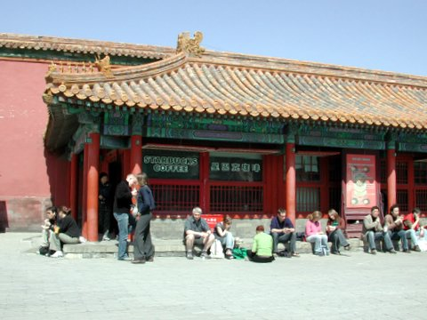
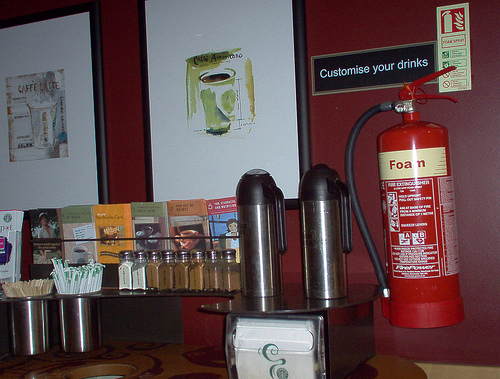

Starbucks is the megalithic corporate coffee company that is on literally every street in its birthplace, downtown Seattle.

Starbucks is an international phenomenon with nearly 11,000 stores and 6.4 billion dollars in revenue last year. The company can move swiftly and forcefully into new products as it did when it bought Tazo Tea in 1999. The power of market domination allows them to simply buy out their competition when they wish as they did with Torrefazione and Seattle’s Best in 2003. They can dominate green coffee bean markets with their substantial buying power and leverage.

Starbucks (like Microsoft just across Lake Washington) is in the paradoxical position of enjoying market supremacy and broad disdain at the same time. From labor issues to fair trade to ‘promoting homosexuality’ to charges of homogenization they are under constant scrutiny and criticism.

  
*Starbucks located in the Palace Museum (“Forbidden City”), Beijing, Peoples Republic of China. Photo was taken by Larry Finch.*

They are often the subject of parody (not laughing at themselves). When Steve Martin’s L.A. Story (1991) character orders his coffee “I’ll have a half double decaffeinated half-caf, with a twist of lemon” it was a direct hit on the absurd new coffee culture. And, remember the [2000 *Consumer Whore*](https://www.printmag.com/branding-identity-design/starbucks-design-starbung-wars-and-consumer-whores/) logo by cartoonist Kieron Dwyer. Starbucks sued Dwyer for his work and the case was settled.

### Why you are right to hate Starbucks (or at least resent them).

Starbucks is hell-bent on world domination. When a new Starbucks springs up in your neighborhood the old coffee shop may not survive (but also may benefit). The indy shop will have to rally for customer loyalty. As a bi-product of the new Starbucks, they may find their rents going up as well. A well-run indy shop can make it right next door to a Starbucks – but not every time. Other signs of vanity are the forays into music, product placement in media, and now movie promotion.

“Will that be a Tall, Grande, or a Venti?” Starbucks’ menu language is just stupid – especially for espresso drinks. All I have to say is “tall” is small. The barista or cashier will not speak to you in a normal cafe speak either… If you order a double cappuccino, you get the most dreaded question of all – “Will that be a Tall, Grande, or a Venti?”

Fair Traders Cry “Foul!” After getting drummed by activists, S.B. did add fair trade options to the lineup. They claim to pay near fair trade prices for most of the beans they buy and I believe that. However, Fair Trade is a movement that deserves the kind of support that Starbucks is really capable of.

“Line up, suckers.” If the long lines out the door were for being so great and so popular that would be fine. But, the sad fact is that they purposefully designed the shop layout to encourage snaking lines to create a sense of excitement, and encourage the sheep mentality in consumers. For people who pay attention to this stuff, it shows a lack of respect for the customer.

### Why should you love Starbucks (or at least not hate it)?

An American Success Story, Starbucks was opened in 1971 by 3 partners (school teachers) who had a simple mission to bring great coffee and espresso to their town (these original partners later sold their stake and purchased Peet’s). The growth and proliferation of the company are simply admirable. The fact is that a lot of the anti-Starbucks sentiment is green envy.

Need a good cup of Joe? When I visit my in-laws in a suburb of San Diego I thank Poseidon for the Starbucks mermaid in the strip mall just a block away. The closest independent operator is several miles away and frankly, they have bad products and poor service. Starbucks is served on airlines, in restaurants, and at events that likely would have used something far worse.

  
*Photo By [Jim J.](http://www.flickr.com/photos/11358744@N06/1099021236/) of Colorado Springs taken inside a Starbucks in Glasgow, Scotland.*

Starbucks is a catalyst for an industrial revolution. The coffee industry has been revolutionized in no small part due to the standards set and held by Starbucks. In the early days of the specialty coffee movement, Starbucks was the best quality and highest style coffee outlet (unless you had an old Italian community in your city). Today, in contrast, independent shops and roasters produce higher quality and more interesting products, ultimately benefiting the consumer.

This conversation is ongoing in the specialty coffee industry. There are many loving fawning and loyal fans of Starbucks. [One guy](/winter-coffee-achiever/ "Winter") is trying to visit every Starbucks on the Planet. *But they are all the same, right?* Most consumers love Starbucks less as they learn more about coffee cultivation & roasting. They want to explore more interesting and inventive coffee blends. Like most things, Starbucks is not all good or all bad but capable of both.
