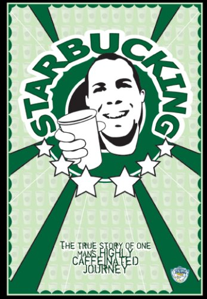

### Winter: Minor Celebrity, Major Coffee Achiever

Only two people have ever recognized Winter on sight. So when somebody refers to Winter as a celebrity, he’s quick with a clarification – he is, in his own words, a “minor celebrity.”

When Winter walks up to the counter at a Starbucks and tells the barista why he’s there, that’s when there’s the flash of recognition. Nearly half of them have heard of Winter and his project. This is the guy who is trying to visit every Starbucks.

“People are fascinated by something that’s so radically different from what they’re used to,” Winter said.

The Starbucks you habituate? If you live in North America, the odds are a bit better than 92 percent that Winter’s been there, downed half a tall cup (4 ounces of the Coffee of the Day), and snapped a photo of the cafe that he’s posted on his website, [Starbuckseverywhere.net](http://Starbuckseverywhere.net). He’s been to 6,900 Starbucks, and 10 years after this endeavor began, he travels at a faster clip than ever before. In recent months, his mission is twofold – he continues to visit new locations, while promoting the April 2007 DVD release of “[Starbucking](/starbucking-honest-artistry/),” a documentary in which Winter stars and has a 25 percent stake in the profits.

“\[The trips\] are enjoyable but … many more of the trips I’ve taken have an air of work about them because they’re so rushed,” Winter said. “I’ve found myself … rushing more than I used to.”

Between the new media and the old, word gets out about Winter. His own website goes into rich detail chronicling his travels. Its links are testimony to the curiosity people have in his hobby. Winter has been the subject of dozens of articles in recent years, in hard-copy newspapers, on websites, and on the AP wire. He’s been interviewed on more radio stations than he can count, on CNN, FOX News, and the Wayne Brady Show; several of these interviews are on Youtube.

The Internet Era and the Starbucks Era have combined to elevate Winter to a “minor celebrity” status that is unique to these times. Winter is never really “under the radar” of celebrity, but not squarely on it, either.

### Don Quixote, Sisyphus, or None of the Above?

Fred Marion of Cox News Service called Winter “a modern-day Sisyphus.” For the most part, Winter agrees with the description. In 2002, he estimates he’d been to nearly 98 percent of all the Starbucks that then existed.

The problem, of course, is that new Starbucks keeps opening up at warp speed. The chain expands faster than Winter can visit the new ones. The raw number of cafes Winter has visited keeps climbing, but the percentage plateaus. In the past five years, Winter estimates that he’s hovered between the 92 percent and 97 percent marks.

He no longer plans on going to every Starbucks in the world — the chain’s proliferation abroad has made it just about impossible. “Internationally, I can’t even hope to keep it up,” Winter said. “All I can hope to do is the highest number possible.”

In North America? That, Winter believes, could be done one day. He’s hoping that the pace of his “Starbucking” promotional tour will bring him back to the 99 percent mark. But somewhat surprisingly, Winter isn’t obsessed with reaching 100 percent.

“I know that I could do it,” he said. “But nothing will happen if I do. Nothing magical will happen when I do it.”

### A Philosophical Turn

Now that Winter has your attention, he’d like you to know something.

“One big shift in my mind is that I’m now more interested in my philosophy,” Winter said. “I’m hoping that in my next job I can find some time to do more writing, not Starbucks travel so much.”

His writing will center on his own philosophy, which, though articulated on his website, remains a work in progress. “Hopefully I will motivate myself to make that stuff coherent,” he said.

As Winter sharpens his worldview he thinks everybody else should, too. “Any kind of philosophy would do a lot of people a lot of good,” Winter said. He feels fortunate that his high school taught philosophy, and he hopes that in upcoming years he will have time to reacquaint himself with some of the classic philosophers.

Winter describes some of his personal philosophy in “Starbucking.” Summarizing it in a recent interview, Winter said, “Mankind in the 21st century should have a level of technology that obviates the need to work for survival. All people’s basic needs should be taken care of … thus freeing them up to pursue something higher, whether artistic or personal ambition or something scientific.”

For the most part, Winter said, his Starbucks travel obsession and his philosophy are separate from one another. If there is any overlap, it lies in the fact that his Starbucks travels are something wholly different from mere survival. Winter Starbucks because he wants to; the hobby is entirely unique to him.

When most of us think of a Starbucks cafe, we think of a few (OK, maybe a dozen or two) locations in our area. Perhaps a few near our home, perhaps a few near where we work. Winter hopes he will never view it that way.

“I could never be satisfied being in one place,” Winter said. He moved out of his apartment in Plano, Texas in 1999, and he’s rarely put his roots down anywhere since. It’s the way he prefers it. He works on medium-term computer programming contracts, which ideally leave him several months each year to pursue his Starbucking road trips.

“I’ve experienced so many cool cities traveling across the country that I want to continue experiencing them on a regular basis,” Winter said.

Winter hopes that the release of the DVD “Starbucking,” combined with increased media attention, will draw more interest to his website, especially the link about his philosophy. It is this direction – the philosophical one – that he hopes his life will take in upcoming years.

### Keep on Starbuckin’

Winter doesn’t plan on stopping his Starbucks road trips any time soon. On the 10-year anniversary of his grand Starbucks scheme, he says he’s nearly certain it will last at least five years more; he can easily see it going another 10 years from this point.

In 2002, INeedCoffee saluted [Winter as a Coffee Achiever](/winter-coffee-achiever/). Upon the DVD release of “Starbucking,” we now give him an unprecedented second tribute as a Coffee Achiever. So many stars have aligned to make him the “minor celebrity” he claims to be – the Internet Era, the international Starbucks explosion, and the 21st-century economy that enables Winter to support his travels. As Winter closes in on his 7,000th Starbucks visit, the 28,000 ounces of coffee he’s consumed along the way mean his credentials as a Coffee Achiever simply cannot be questioned.
