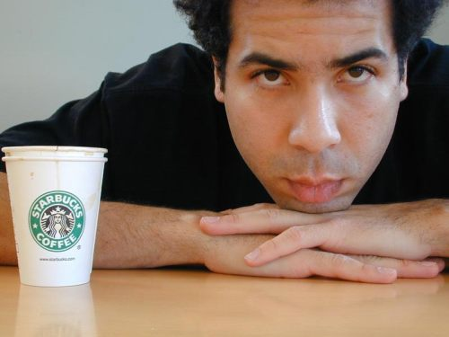
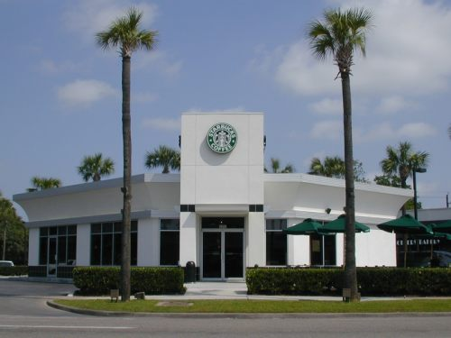

When Winter saw Memorial Day fast approaching on his calendar, it quickly triggered a thought: “I hate to waste a three-day weekend.”

For Winter, making the most of the weekend will entail hopping into his ’97 Integra and cruising out of his hometown in Plano, Texas, visiting as many Starbucks cafes as humanly possible. As he speculates on the possibilities, Winter estimates that he can reach California and return to Texas in time to return to his work as a computer programmer, all in three days’ time.

So who exactly qualifies as a Coffee Achiever? Winter may be the textbook example of one, having visited 2830 of some 3352 Starbucks cafes in North America, according to his estimates. It is his routine to drink a half-cup of coffee at each Starbucks he visits, and he customarily photographs each cafe as well. On a day when Winter visits 30 Starbucks (it’s happened), his work is cut out for him. His photos from these journeys are online at his site, [StarbucksEverywhere.net](http://www.starbuckseverywhere.net/), the compilation of a Coffee Achiever’s travels.

  
*Winter – Coffee Achiever*

### Mermaid’s Conception

A longtime lover of road trips, Winter had long been willing to cruise a good distance for his favorite concerts, and he fondly remembers Lillith Fair acts and REM shows that he traveled a good distance to see. Winter’s fondness for travel, paired with his fondness for hanging out at El Plano’s first Starbucks, helped plant the idea for the hobby that would follow.

> “\[I\]t had to do with discussions… of how quickly Starbucks was growing and how they hoped to have 2000 locals by the year 2000. At some point I, or somebody there, wondered out look how neat it might be to try to visit them all.”
> 
> “It was back in ’97 when I conceived of the idea,” said Winter, now 30 years old. “I wasn’t photographing them; I was just keeping a list.”
> 
> “Traveling and visiting new places is definitely a big attraction,” said Winter. Another favorite element is “the driving. I really don’t get bored all that much… The miles just seem to go by pretty easily.”

### Mocha Freeze-Frame

The photos that adorn Winter’s website have not always been part of the process. It was approximately two years after he began visiting Starbucks with a vengeance that he began to photograph them on a regular basis.

> “I rediscovered my old love of photography,” said Winter. “I took about 8,000 photos between high school and college… I began to see that Starbucks didn’t all look alike and were actually worth photographing.”

Photographing the Starbucks remains secondary to visiting them and drinking the coffee, Winter emphasizes. While he considers composition and lighting when taking his pictures, he does not believe that the artistic element is exactly his forte.

> “I’ve got a lot of work to do there,” he says concerning photography. “I’ve never taken an art class.”

### Keeping a Frantic Pace

Winter’s travels are not for the faint of heart, involving a lot of caffeine, a lot of driving, and often very little sleep. He visited approximately 400 Starbucks franchises during a three-week road trip that ranged from Houston, Texas, to Freeport, Maine, to Savannah, Ga., to Jacksonville, Fla., to Chicago, Ill. Winter doesn’t make it easy on himself, either, preferring to go out of his way to visit a smaller town’s lone Starbucks rather than numerous ones in the same city.

  
*Big River Oaks II – Houston by Winter*

How does he maintain this pace? With a road lifestyle far different from the routines of home – while Winter will sleep nine or ten hours each night at home, he has gone for several days at a time on two or three hours sleep per night on some of his voyages.

> “I’ve crashed at a rest stop at 3 a.m., waken up at 5, and been back on the road,” said Winter. “I suffer for it; I can get some really intense headaches.” Starbucks Everywhere FAQ

Many are curious how Winter can keep pace with the rapidly expanding franchise, and wonder whether he visits each and every Starbucks cafe in Barnes & Noble bookstores, for instance. Winter’s site, however, comes with a FAQ that has anticipated such questions. From his FAQ:

> “I’m only interested in visiting locations owned and operated in whole or in part by Starbucks corporation. Albertson’s locations are called licensed stores, or business affiliates, and they are run by the grocery store. Barnes & Noble Cafes are not even that–they just serve the coffee. Now, some B&N locations do have a Starbucks proper attached, and those do count.”

### Conclusion

Winter’s somewhat Warholian hobby has brought him a measure of fame in recent months. He has been profiled in an AP story and was subsequently interviewed by about 30 radio stations. Unaffiliated with Starbucks (save a brief stint working at one part-time), Winter is nonetheless happy to see that those in Seattle and elsewhere are beginning to take notice of his ambitious travel theme.

Capable of downing dozens of cups of coffee a day, in near-perpetual motion, and devoted to accomplishing an unprecedented feat, Winter is highly deserving of INeedCoffee’s recognition as a true Coffee Achiever.

**UPDATE:** [Winter: Coffee Achiever 2.0](http://ineedcoffee.com/winter-coffee-achiever-2-0/)

**UPDATE March 2021:** The Starbucks Everywhere FAQ is no longer online.