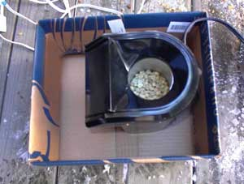

In the article [Roast Your Own](/roast-your-own-coffee/), I showed you how easy it is to home roast coffee using a popcorn popper, but I didn’t mention the popper roaster’s nemesis: Old Man Winter.

Cold winds and bitter temperatures have a negative impact on outdoor roasting in a popper. Coffee roasting requires a high temperature and when the cold winds start whipping around the machine, the coffee beans are cooled. The lower the roast temperature, the longer the roast will take. There are many good aspects of slow-roasted coffee, but cold temperatures can be deadly to your roasting efforts. Simply put: if the roast gets too cold and takes too long the final result will be unpalatable coffee.

Should we give up on home roasting during the winter? Should we deprive ourselves of fresh home roasted coffee? NO! My goal was to devise a method to fight off the cold temperatures and roast great-tasting coffee. For this article, I had a fellow roaster in San Diego, California roast the exact same type of coffee bean as I roasted in Columbus, Ohio. Could I get the same roasting times in a sub-freezing environment as I could on a sunny day in California?

### Coffee Roasting: Warm Weather vs Cold Weather

Roasting Brazil Cerrado Monte Carmelo with West Bend Poppery II in Columbus and San Diego yielded different results. Columbus was 22 F with a 14 MPH wind, while San Diego was 68 F with a 5 MPH wind. The roast in San Diego achieved the first crack at 4 minutes and 30 seconds. Due to the extreme cold environment, the Columbus roast never even got to the first crack.

  
*Cold Weather Coffee Roasting*

### A Ruined Batch

To demonstrate what it is like trying to roast coffee in the cold without modifying the environment or popper, I did a sample batch, taking pictures along the way. As you can see from the pictures, trying to roast without controlling the environmental factors was disastrous. The extremely cold weather is just too much for this little popper to handle. It can’t heat the ambient cold air fast enough to roast the coffee beans effectively.

  
*4.5 minutes into a cold roast*

  
*At 11 minutes, this roast is hopeless.*

The result was completely unacceptable. By the 11-minute mark, these coffee beans were unevenly roasted and they had only reached a cinnamon roast. The roast was uninspiring and I knew better than to brew and taste the lifeless coffee. But even more unacceptable to me was the notion that I could not roast during the winter. I decided to modify the roasting conditions in an effort to control the ambient temperature.

### The Modification

  
*Normal coffee roasting in cold temperatures*

  
*Popper in a box – Roasting in cold Temperatures*

My modification ideas were simple: if I could trap the warm air and recycle it, I could simulate a warm environment.

  
*A box serves as a windbreaker when coffee roasting in the cold.*

  
*Use the hood and box flap to redirect hot air.*

I knew that I had to stop the wind from entering the popper’s air intake fan in order to get a good roast. I began the roast by placing the popper inside a slightly larger box. In fact, I used the original box in which the popper was purchased. This successfully shielded the popper from the wind. I waited until the chaff blew off the beans. Also around this time, the beans stop spinning and begin to jump in the roaster. Then I made my second set of modifications.

The second set of modifications was intended to trap the warm air as much as possible. I added the popper’s hood attachment. This directed the hot air down into the box. I also lifted the box flap so as to further capture the hot air.

### Results

After making the modifications, the results were impressive. I was able to roast the coffee in an acceptable amount of time. I reached the first crack reached at 4 1/4 minutes into the roast. A second crack began at about the time that I decided to stop roasting: at 7 1/4 minutes. These times are roughly equivalent to those achieved in warm weather.

  
*Results after modification (7 1/4 minutes)*

  
*Results without modification (11 1/2 minutes)*

### Summary

By using a cardboard box and the popper’s hood attachment, I was able to ward off Old Man Winter and roast my coffee outdoors. These are probably some of the simplest modifications that you can make, but they proved very safe and effective. There are other ideas for conquering the cold weather; just [don’t use a space heater](/cold-weather-coffee-roasting/). Armed with this information, I encourage all of my fellow popper roasters living in cold climates to don their winter coat and roast some coffee.
